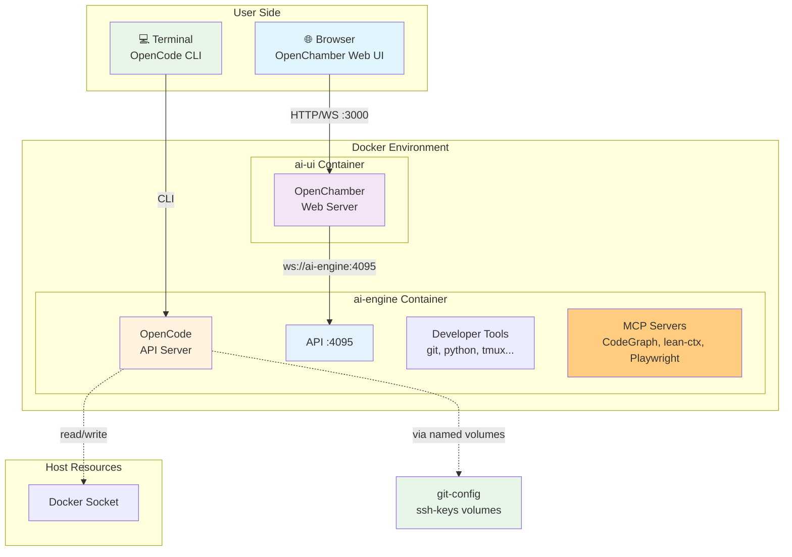
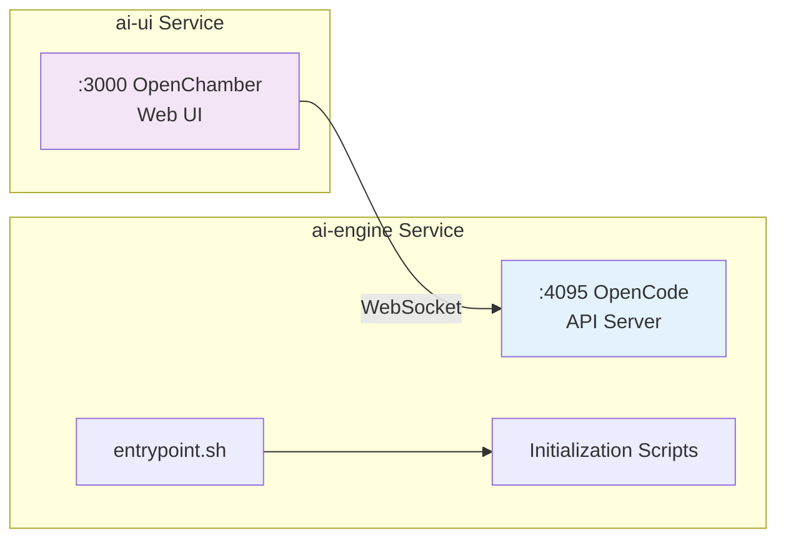
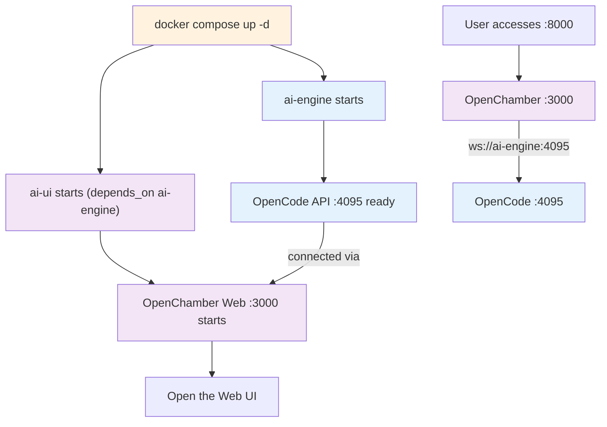
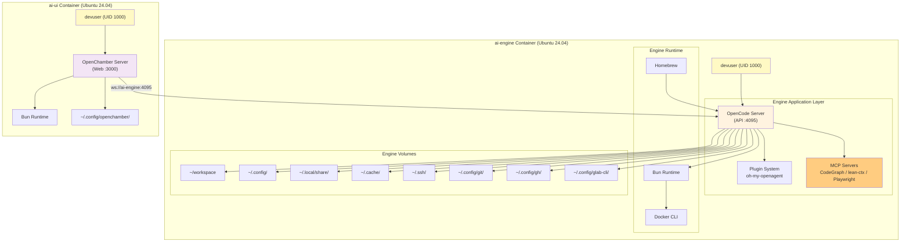
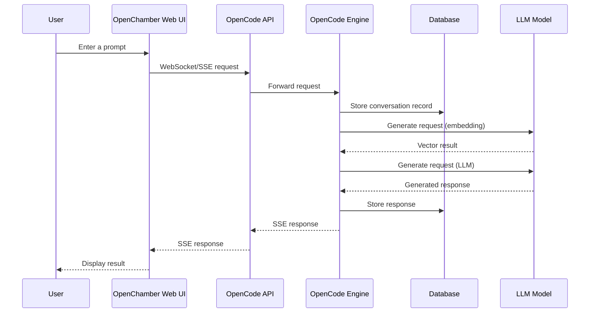
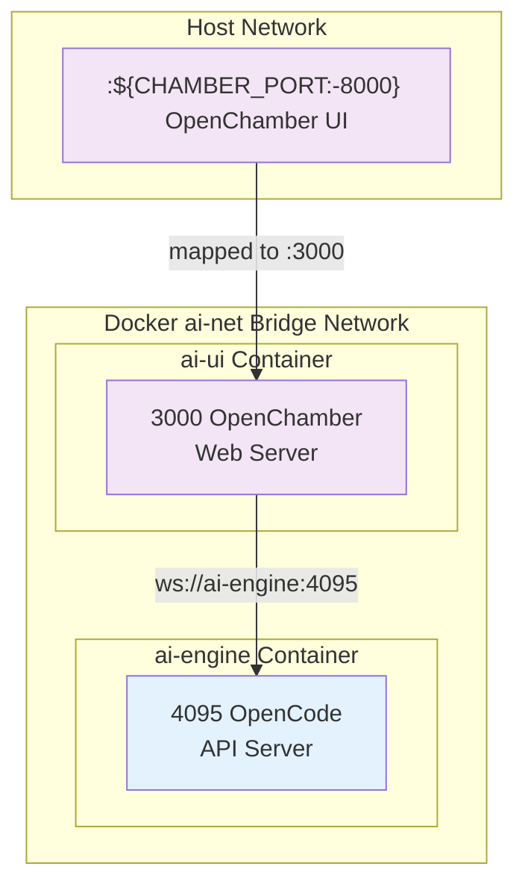
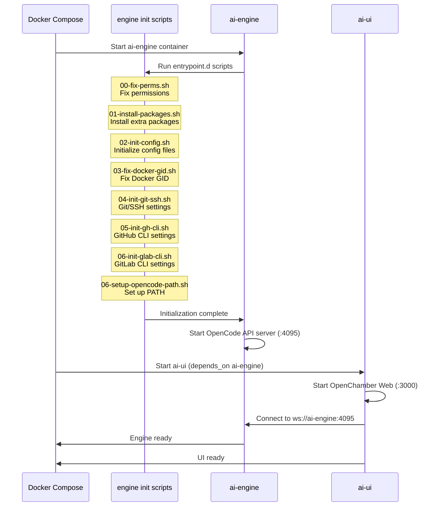
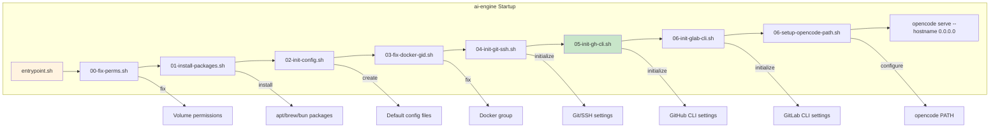
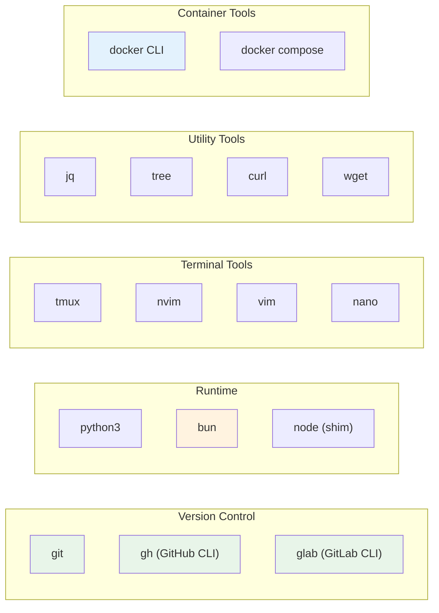

# Architecture Guide

This document explains the ai-engkit system architecture, the relationships between components, and the main data flows.

## Table of Contents

- [System Overview](#system-overview)
- [Service Architecture](#service-architecture)
- [Container Architecture](#container-architecture)
- [Data Flow](#data-flow)
- [Network Architecture](#network-architecture)
- [Storage Architecture](#storage-architecture)
- [Startup Flow](#startup-flow)
- [Component Reference](#component-reference)

## System Overview

ai-engkit is a Docker-based AI development environment that splits the workload across two containers: **ai-engine** (OpenCode API, MCP servers, CLI tools) and **ai-ui** (OpenChamber web UI). The two containers communicate over a shared Docker bridge network.



## Service Architecture

### Primary Services



### Service Dependencies



## Container Architecture

### Container Layout



## Data Flow

### AI Conversation Flow



## Network Architecture

### Container Network Topology



### Environment Variables

| Variable | Purpose | Default | Scope | Container |
|------|------|--------|------|----------|
| `CHAMBER_PORT` | Web UI host port | 8000 | Host | `ai-ui` |
| `OPENCODE_SERVER_PASSWORD` | API authentication | `devonly` | Application | `ai-engine` |
| `OPENCHAMBER_UI_PASSWORD` | Web UI authentication | `chamber` | Application | `ai-ui` |
| `OPENCODE_HOST` | OpenCode API URL (for remote connect) | `http://ai-engine:4095` | Service link | `ai-ui` |
| `OPENCODE_SKIP_START` | Skip auto-starting OpenCode locally | `true` | Service link | `ai-ui` |

## Storage Architecture

### Volume Configuration

```mermaid
graph TB
    subgraph "Docker Volumes"
        VOL_WS["workspace<br/>Project files"]
        VOL_DATA["opencode-data<br/>Database"]
        VOL_CONFIG["opencode-config<br/>Configuration"]
        VOL_CACHE["opencode-cache<br/>Cache"]
        VOL_OHMY["ohmyopencode-cache<br/>Plugin cache"]
        VOL_CHAMBER["openchamber-data<br/>UI settings"]
        VOL_GIT["git-config<br/>Git settings"]
        VOL_SSH["ssh-keys<br/>SSH keys"]
        VOL_GH["gh-config<br/>GitHub CLI settings"]
        VOL_GLAB["glab-config<br/>GitLab CLI settings"]
        VOL_LC_DATA["lean-ctx-data<br/>Vector index / knowledge base"]
        VOL_LC_STATE["lean-ctx-state<br/>Event logs"]
    end

    subgraph "ai-engine Paths"
        E_WS["~/workspace"]
        E_DATA["~/.local/share/opencode"]
        E_LC_DATA["~/.local/share/lean-ctx"]
        E_LC_STATE["~/.local/state/lean-ctx"]
        E_CONFIG["~/.config/opencode"]
        E_CACHE["~/.cache/opencode"]
        E_OHMY["~/.cache/oh-my-opencode"]
        E_CHAMBER["~/.config/openchamber"]
        E_GIT["~/.config/git<br/>~/.gitconfig"]
        E_SSH["~/.ssh"]
        E_GH["~/.config/gh"]
        E_GLAB["~/.config/glab-cli"]
    end

    subgraph "ai-ui Paths"
        U_CHAMBER["~/.config/openchamber"]
    end

    VOL_WS --> E_WS
    VOL_DATA --> E_DATA
    VOL_CONFIG --> E_CONFIG
    VOL_CACHE --> E_CACHE
    VOL_OHMY --> E_OHMY
    VOL_CHAMBER --> E_CHAMBER
    VOL_CHAMBER --> U_CHAMBER
    VOL_GIT --> E_GIT
    VOL_SSH --> E_SSH
    VOL_GH --> E_GH
    VOL_GLAB --> E_GLAB
    VOL_LC_DATA --> E_LC_DATA
    VOL_LC_STATE --> E_LC_STATE

    style VOL_WS fill:#fff3e0
    style VOL_DATA fill:#e3f2fd
    style VOL_GIT fill:#e8f5e9
    style VOL_SSH fill:#e8f5e9
    style VOL_GH fill:#e8f5e9
    style VOL_GLAB fill:#e8f5e9
```



### Persistence Strategy

| Data Type | Storage Location | Retention | Backup Recommendation |
|---------|---------|---------|---------|
| Project files | workspace | Critical | Back up regularly to Git |
| Conversation history | opencode-data | Critical | Export regularly |
| User configuration | opencode-config | Critical | Keep under version control |
| Git settings | git-config | Critical | Includes `.gitconfig`, `.git-credentials` |
| SSH keys | ssh-keys | Critical | Includes `known_hosts` |
| GitHub CLI settings | gh-config | Critical | Includes host auth and cache |
| GitLab CLI settings | glab-config | Critical | Includes host auth and cache |
| Cache data | opencode-cache | Rebuildable | No backup needed |
| UI settings | openchamber-data | Normal | No backup needed |
| lean-ctx vector index / knowledge base | lean-ctx-data | Critical | Includes sessions, vectors, graphs, knowledge |
| lean-ctx event logs / state | lean-ctx-state | Normal | Includes events, journal, agent keys |

## Startup Flow

### Container Startup Order



### Initialization Script Order



## Component Reference

### OpenCode

| Attribute | Description |
|------|------|
| Purpose | AI coding assistant (backend engine) |
| Version | See `ARG OPENCODE_VERSION` in `Dockerfile` |
| Config file | `~/.config/opencode/opencode.json` |
| Database | `~/.local/share/opencode/opencode.db` |
| API port | 4095 |
| Protocol | HTTP + SSE (Server-Sent Events) |
| SDK | `@opencode-ai/sdk` |

### OpenChamber

| Attribute | Description |
|------|------|
| Purpose | Web/Desktop UI for OpenCode (frontend GUI) |
| Version | See `ARG OPENCHAMBER_VERSION` in `Dockerfile` |
| Relationship to OpenCode | Separate project that connects to OpenCode over API |
| Service port | 3000 (mapped to host port 8000) |
| Transport | WebSocket (terminal) + SSE (chat) |
| Frontend framework | React (Tauri for desktop) |

> 📝 **Architecture note**: OpenChamber is not part of OpenCode. It is a separate project ([openchamber/openchamber](https://github.com/openchamber/openchamber)) that acts as a client and connects to the OpenCode server through `@opencode-ai/sdk/v2`, either by starting a local server automatically or by connecting to a remote one.

### Developer Toolchain



### Plugin System

| Plugin | Purpose | Description | Version Management |
| `oh-my-openagent` | Core framework | Extends baseline OpenCode functionality | Supports build-time version pinning |

### Plugin Version Management (Development)

You can specify plugin versions when building the image:

```bash
# Use the latest version (default)
docker compose -f docker-compose.dev.yml build

# Pin a specific version
OH_MY_OPENAGENT_VERSION=3.15.0 LANCEDB_OPENCODE_PRO_VERSION=0.7.0 \
  docker compose -f docker-compose.dev.yml build
```

## Configuration Options

### Dynamic Package Installation

Install extra packages at container startup through environment variables:

```bash
# .env
APT_PACKAGES="htop,iotop"
BREW_PACKAGES="ghq"
BUN_PACKAGES="typescript"
```

### Workspace Options

| Mode | Setting | Advantages | Drawbacks |
|------|------|------|------|
| Named Volume | Leave `WORKSPACE_PATH` unset (default since v0.5.0) | Managed by Docker, auto-initializes Git/SSH settings | Requires `docker cp` for direct host access |
| Bind Mount | `WORKSPACE_PATH=./workspace` | Editable directly with a local IDE | Permission issues are more common |
| Host Path | `WORKSPACE_PATH=/home/user/projects` | Reuses an existing project directory | Requires careful permission management |

---

> 📖 **Further reading**: See [TROUBLESHOOTING.md](./TROUBLESHOOTING.md) for common issues.
