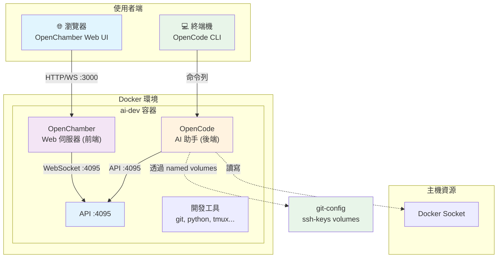
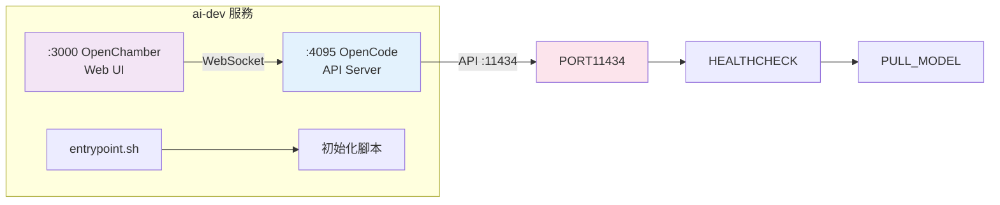
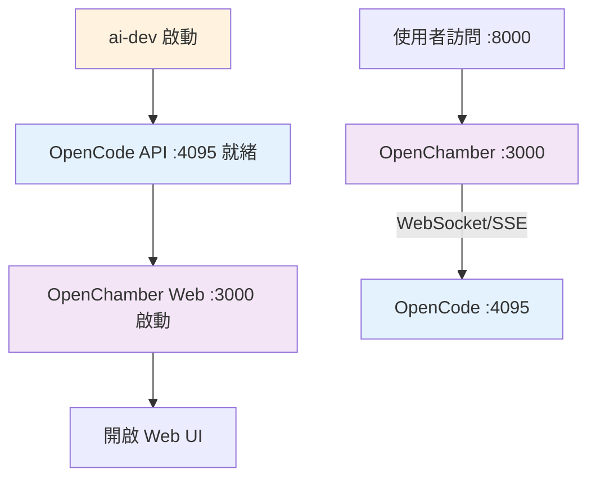
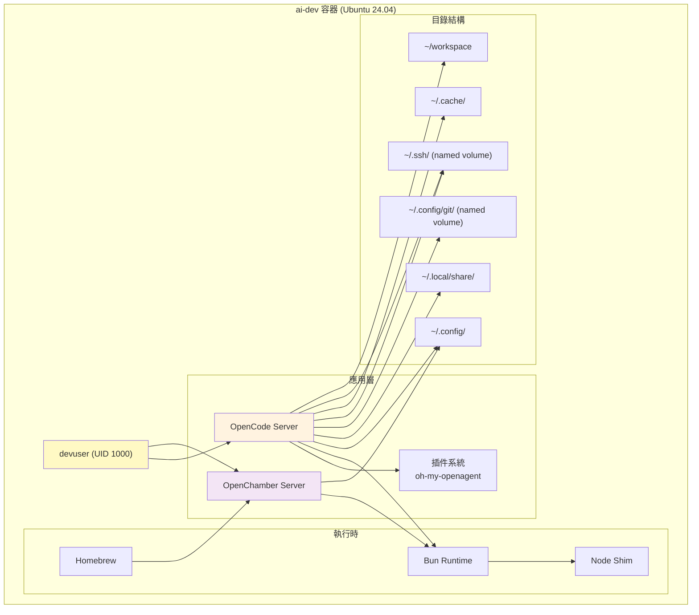
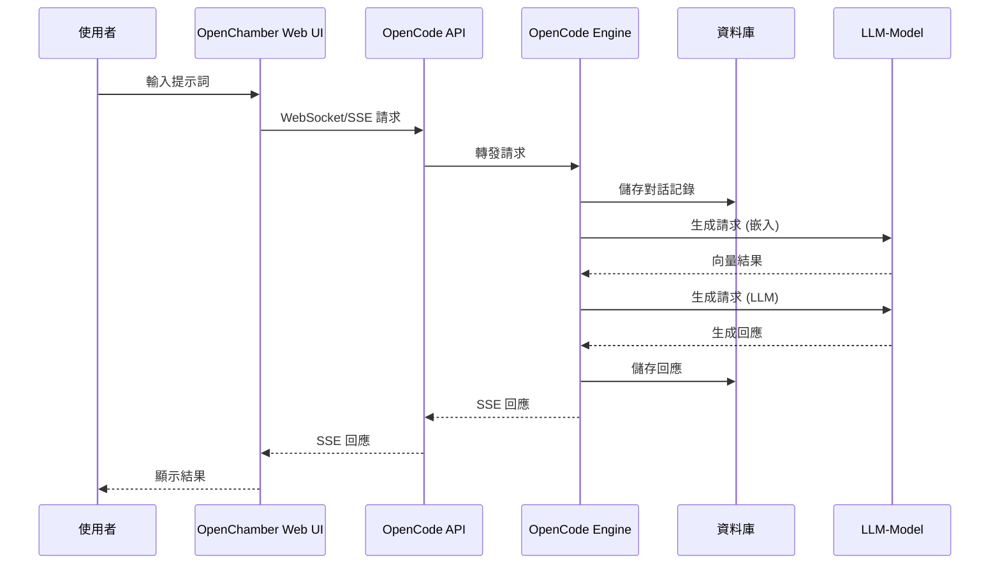
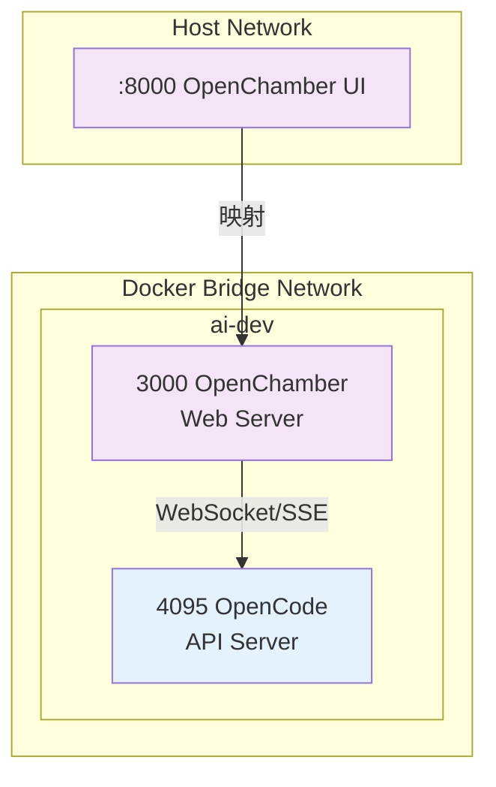
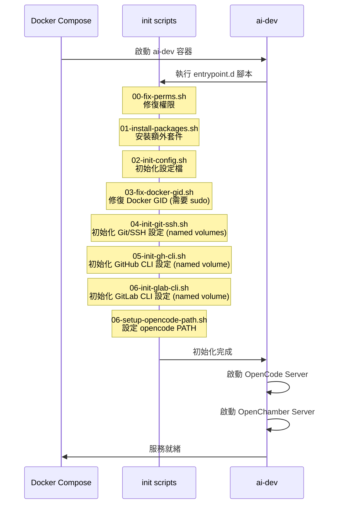
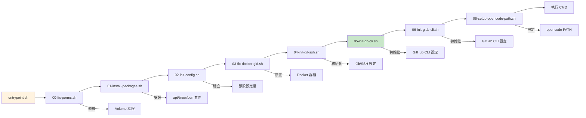
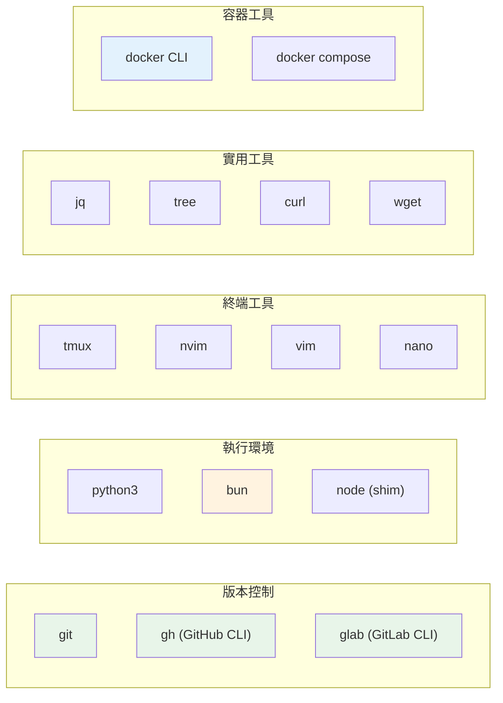

# 架構說明

本文檔說明 ai-engkit 專案的系統架構、元件間的關係及資料流程。

## 目錄

- [系統概覽](#系統概覽)
- [服務架構](#服務架構)
- [容器架構](#容器架構)
- [資料流](#資料流)
- [網路架構](#網路架構)
- [儲存架構](#儲存架構)
- [啟動流程](#啟動流程)
- [元件說明](#元件說明)

## 系統概覽

ai-engkit 是一個基於 Docker 的 AI 開發環境，整合了 OpenCode AI 助手（後端）、OpenChamber Web UI（前端的 Web 介面）以及預先安裝好的常用開發工具。



## 服務架構

### 主要服務



### 服務依賴關係



## 容器架構

### ai-dev 容器內部結構



## 資料流

### AI 對話流程



## 網路架構

### 容器網路拓樸



### 環境變數配置

| 變數 | 用途 | 預設值 | 範圍 |
|------|------|--------|------|
| `CHAMBER_PORT` | Web UI 埠號 | 8000 | 主機 |
| `OPENCODE_SERVER_PASSWORD` | API 認證 | `devonly` | 應用層 |
| `OPENCHAMBER_UI_PASSWORD` | Web UI 認證 | `chamber` | 應用層 |

## 儲存架構

### Volume 配置

```mermaid
graph TB
    subgraph "Docker Volumes"
        VOL_WS["workspace<br/>專案檔案"]
        VOL_DATA["opencode-data<br/>資料庫"]
        VOL_CONFIG["opencode-config<br/>設定"]
        VOL_CACHE["opencode-cache<br/>快取"]
        VOL_OHMY["ohmyopencode-cache<br/>插件快取"]
        VOL_CHAMBER["openchamber-data<br/>UI 設定"]
        VOL_GIT["git-config<br/>Git 設定"]
        VOL_SSH["ssh-keys<br/>SSH 金鑰"]
        VOL_GH["gh-config<br/>GitHub CLI 設定"]
        VOL_GLAB["glab-config<br/>GitLab CLI 設定"]
        VOL_LC_DATA["lean-ctx-data<br/>向量索引/知識庫"]
        VOL_LC_STATE["lean-ctx-state<br/>事件日誌"]
    end

    subgraph "容器路徑"
        C_WS["~/workspace"]
        C_DATA["~/.local/share/opencode"]
        C_LC_DATA["~/.local/share/lean-ctx"]
        C_LC_STATE["~/.local/state/lean-ctx"]
        C_CONFIG["~/.config/opencode"]
        C_CACHE["~/.cache/opencode"]
        C_OHMY["~/.cache/oh-my-opencode"]
        C_CHAMBER["~/.config/openchamber"]
        C_GIT["~/.config/git<br/>~/.gitconfig"]
        C_SSH["~/.ssh"]
        C_GH["~/.config/gh"]
        C_GLAB["~/.config/glab-cli"]
    end

    VOL_WS --> C_WS
    VOL_DATA --> C_DATA
    VOL_CONFIG --> C_CONFIG
    VOL_CACHE --> C_CACHE
    VOL_OHMY --> C_OHMY
    VOL_CHAMBER --> C_CHAMBER
    VOL_GIT --> C_GIT
    VOL_SSH --> C_SSH
    VOL_GH --> C_GH
    VOL_GLAB --> C_GLAB
    VOL_LC_DATA --> C_LC_DATA
    VOL_LC_STATE --> C_LC_STATE

    style VOL_WS fill:#fff3e0
    style VOL_DATA fill:#e3f2fd
    style VOL_GIT fill:#e8f5e9
    style VOL_SSH fill:#e8f5e9
    style VOL_GH fill:#e8f5e9
    style VOL_GLAB fill:#e8f5e9
```



### 資料持久化策略

| 資料類型 | 儲存位置 | 保留策略 | 備份建議 |
|---------|---------|---------|---------|
| 專案檔案 | workspace | 重要 | 定期備份到 Git |
| 對話記錄 | opencode-data | 重要 | 定期匯出 |
| 使用者設定 | opencode-config | 重要 | 納入版本控制 |
| Git 設定 | git-config | 重要 | 包含 .gitconfig, .git-credentials |
| SSH 金鑰 | ssh-keys | 重要 | 包含 known_hosts |
| GitHub CLI 設定 | gh-config | 重要 | 包含主機認證、快取 |
| GitLab CLI 設定 | glab-config | 重要 | 包含主機認證、快取 |
| 快取資料 | opencode-cache | 可重建 | 不需備份 |
| UI 設定 | openchamber-data | 一般 | 不需備份 |
| lean-ctx 向量索引/知識庫 | lean-ctx-data | 重要 | 包含 sessions, vectors, graphs, knowledge |
| lean-ctx 事件日誌/狀態 | lean-ctx-state | 一般 | 包含 events, journal, agent keys |

## 啟動流程

### 容器啟動順序



### 初始化腳本執行順序



## 元件說明

### OpenCode

| 屬性 | 說明 |
|------|------|
| 功能 | AI 程式碼助手（後端引擎） |
| 版本 | 見 `Dockerfile` `ARG OPENCODE_VERSION` |
| 設定檔 | `~/.config/opencode/opencode.json` |
| 資料庫 | `~/.local/share/opencode/opencode.db` |
| API 埠號 | 4095 |
| 通訊協定 | HTTP + SSE (Server-Sent Events) |
| SDK | `@opencode-ai/sdk` |

### OpenChamber

| 屬性 | 說明 |
|------|------|
| 功能 | OpenCode 的 Web/Desktop UI（前端的 GUI） |
| 版本 | 見 `Dockerfile` `ARG OPENCHAMBER_VERSION` |
| 與 OpenCode 關係 | 獨立專案，透過 API 連線至 OpenCode |
| 服務埠號 | 3000 (映射至主機 8000) |
| 通訊方式 | WebSocket (terminal) + SSE (chat) |
| 前端框架 | React (Tauri for desktop) |

> 📝 **架構說明**：OpenChamber 並非 OpenCode 的一部分，而是獨立的專案（[openchamber/openchamber](https://github.com/openchamber/openchamber)）。它作為客戶端，透過 `@opencode-ai/sdk/v2` 連線至 OpenCode 伺服器，可選擇本地自動啟動或連線至遠端伺服器。

### 開發工具鏈



### 插件系統

| 插件 | 功能 | 說明 | 版本管理 |
|------|------|------|----------|
| `oh-my-openagent` | 核心框架 | OpenCode 基礎功能擴展 | 支援 build 時指定版本 |

### Plugin 版本管理（開發用）

在建構 image 時可指定插件版本：

```bash
# 使用最新版本（預設）
docker compose -f docker-compose.dev.yml build

# 指定特定版本
OH_MY_OPENAGENT_VERSION=3.15.0 LANCEDB_OPENCODE_PRO_VERSION=0.7.0 \
  docker compose -f docker-compose.dev.yml build
```

## 配置選項

### 動態安裝套件

透過環境變數可在容器啟動時安裝額外套件：

```bash
# .env
APT_PACKAGES="htop,iotop"
BREW_PACKAGES="ghq"
BUN_PACKAGES="typescript"
```

### Workspace 選項

| 模式 | 設定 | 優點 | 缺點 |
|------|------|------|------|
| Named Volume | 不設定 `WORKSPACE_PATH` (v0.5.0 預設) | 容器管理，自動初始化 git/SSH 設定 | 需要 `docker cp` 存取 |
| Bind Mount | `WORKSPACE_PATH=./workspace` | 可直接用本機 IDE 編輯 | 權限問題較常見 |
| 主機路徑 | `WORKSPACE_PATH=/home/user/projects` | 存取現有專案 | 需注意權限 |

---

> 📖 **延伸閱讀**：詳見 [TROUBLESHOOTING.md](./TROUBLESHOOTING.md) 了解常見問題。
