# 架構說明

本文檔說明 OpenChamber 專案的系統架構、元件間的關係及資料流程。

## 目錄

- [系統概覽](#系統概覽)
- [服務架構](#服務架構)
- [容器架構](#容器架構)
- [資料流](#資料流)
- [網路架構](#網路架構)
- [儲存架構](#儲存架構)
- [啟動流程](#啟動流程)
- [元件說明](#元件說明)

## 系統概覽

OpenChamber 是一個基於 Docker 的自託管 AI 開發環境，整合了 OpenCode AI 助手、OpenChamber Web UI 以及 Ollama 本地 LLM 推論引擎。

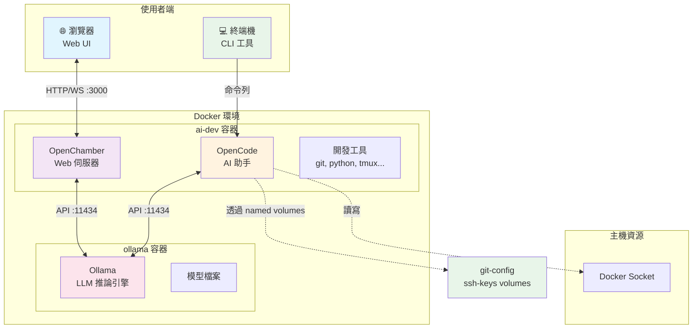

## 服務架構

### 主要服務

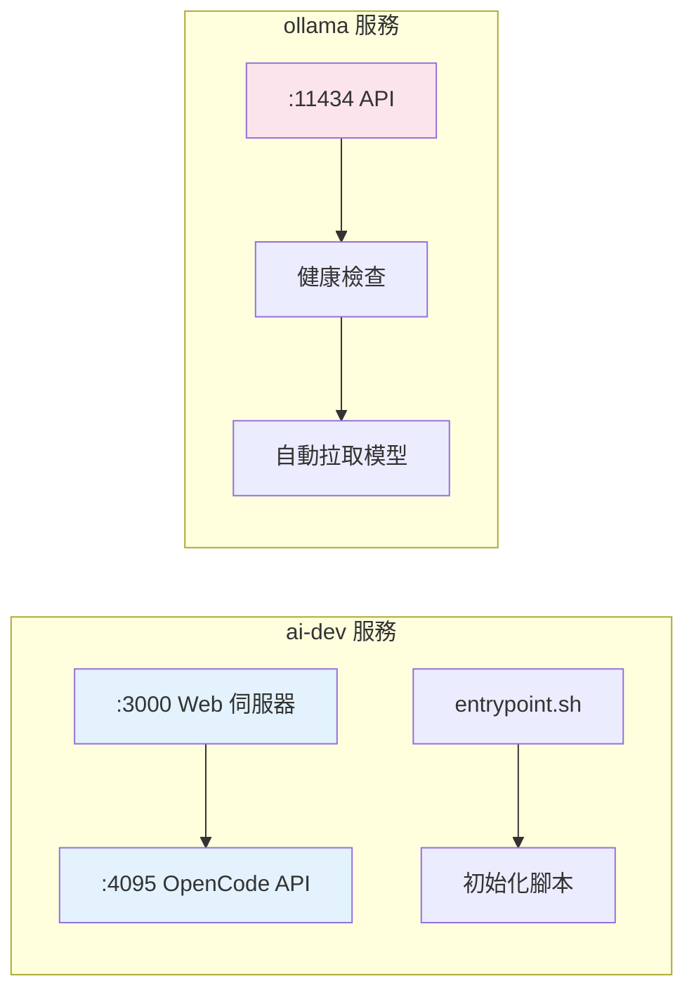

### 服務依賴關係

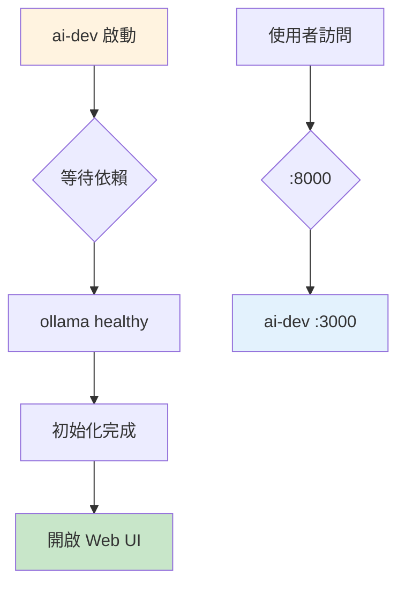

## 容器架構

### ai-dev 容器內部結構

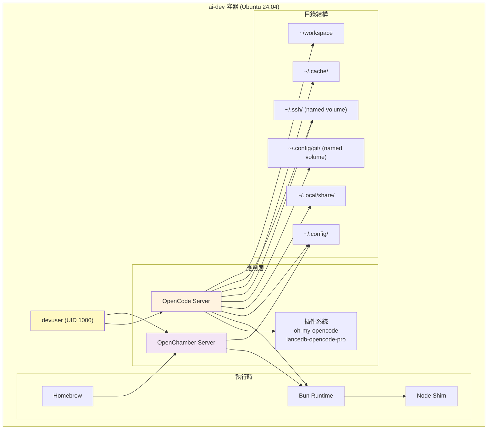

### ollama 容器結構

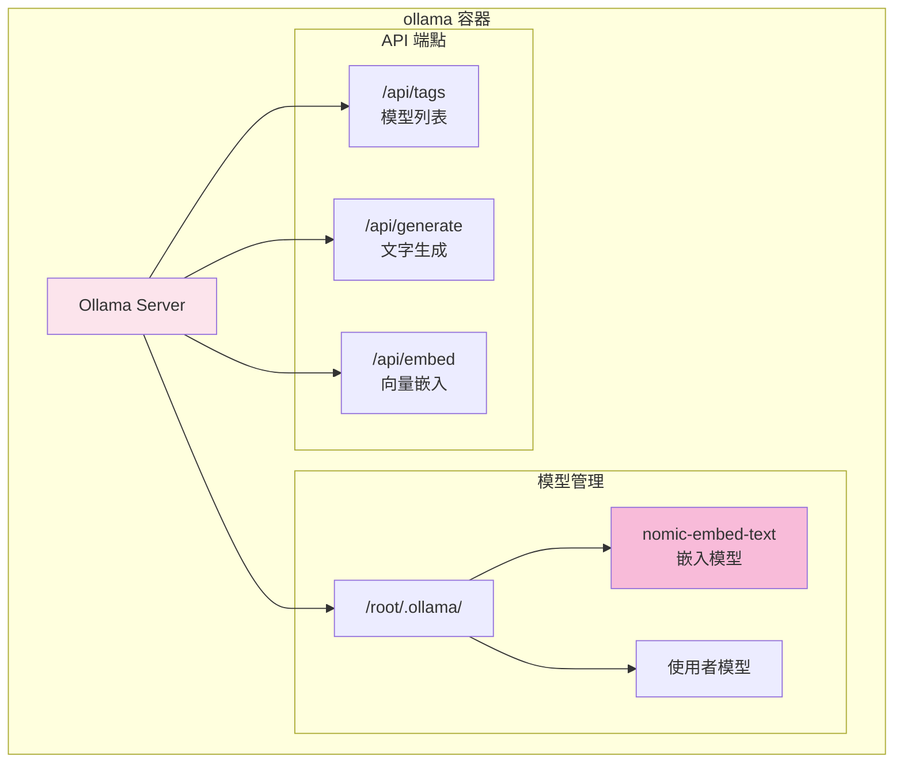

## 資料流

### AI 對話流程

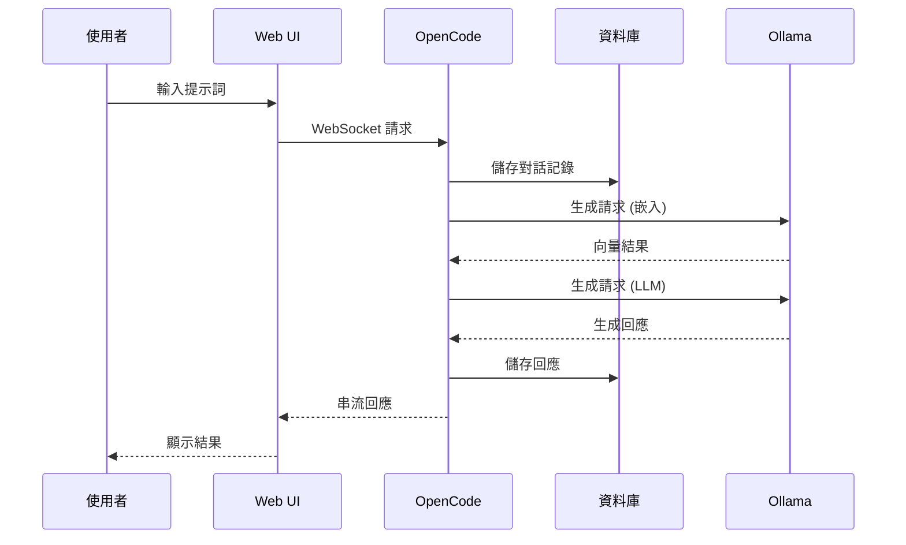

### 嵌入向量流程（LanceDB）

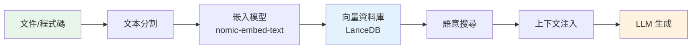

## 網路架構

### 容器網路拓樸

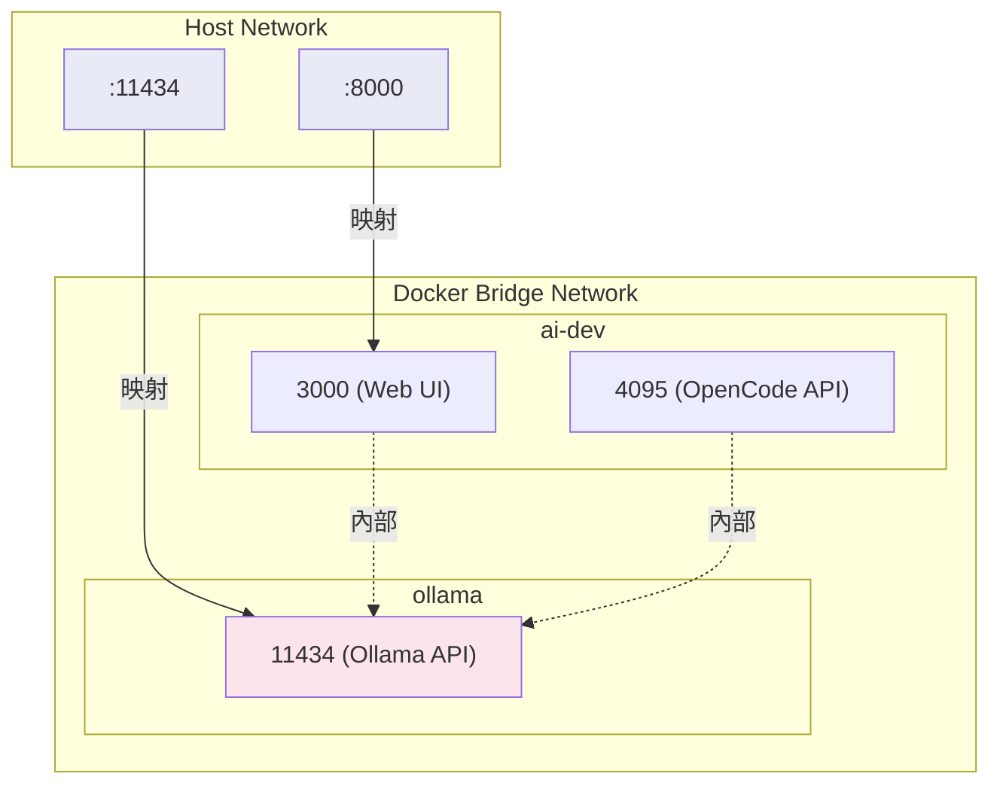

### 環境變數配置

| 變數 | 用途 | 預設值 | 範圍 |
|------|------|--------|------|
| `CHAMBER_PORT` | Web UI 埠號 | 8000 | 主機 |
| `OLLAMA_PORT` | Ollama API 埠號 | 11434 | 主機 |
| `OLLAMA_BASE_URL` | Ollama 內部 URL | `http://ollama:11434` | 容器網路 |
| `OPENCODE_SERVER_PASSWORD` | API 認證 | `devonly` | 應用層 |
| `OPENCHAMBER_UI_PASSWORD` | Web UI 認證 | `chamber` | 應用層 |

## 儲存架構

### Volume 配置

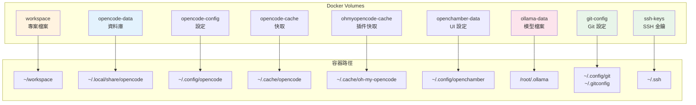

### 資料持久化策略

| 資料類型 | 儲存位置 | 保留策略 | 備份建議 |
|---------|---------|---------|---------|
| 專案檔案 | workspace | 重要 | 定期備份到 Git |
| 對話記錄 | opencode-data | 重要 | 定期匯出 |
| 使用者設定 | opencode-config | 重要 | 納入版本控制 |
| Git 設定 | git-config | 重要 | 包含 .gitconfig, .git-credentials |
| SSH 金鑰 | ssh-keys | 重要 | 包含 known_hosts |
| 快取資料 | opencode-cache | 可重建 | 不需備份 |
| AI 模型 | ollama-data | 可重建 | 不需備份 |
| UI 設定 | openchamber-data | 一般 | 不需備份 |

## 啟動流程

### 容器啟動順序

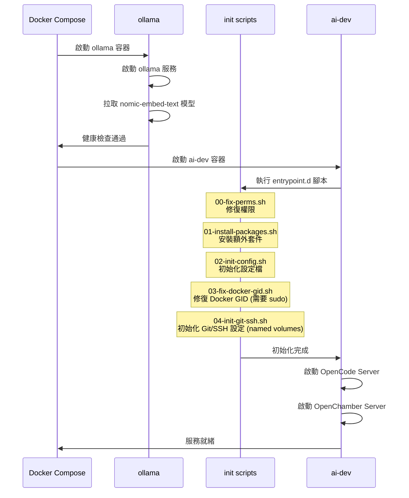

### 初始化腳本執行順序

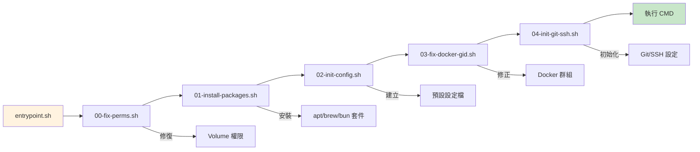

## 元件說明

### OpenCode

| 屬性 | 說明 |
|------|------|
| 功能 | 終端機 AI 程式碼助手 |
| 版本 | 1.3.13 |
| 設定檔 | `~/.config/opencode/opencode.json` |
| 資料庫 | `~/.local/share/opencode/opencode.db` |
| API 埠號 | 4095 (內部) |

### OpenChamber

| 屬性 | 說明 |
|------|------|
| 功能 | 瀏覽器 Web UI |
| 版本 | 1.9.3 |
| 設定檔 | `~/.config/openchamber/settings.json` |
| 服務埠號 | 3000 (映射至主機 8000) |
| 前端框架 | React |

### Ollama

| 屬性 | 說明 |
|------|------|
| 功能 | 本地 LLM 推論引擎 |
| 版本 | latest |
| 模型儲存 | `/root/.ollama/` |
| API 埠號 | 11434 |
| 預設模型 | nomic-embed-text (嵌入) |

### 開發工具鏈

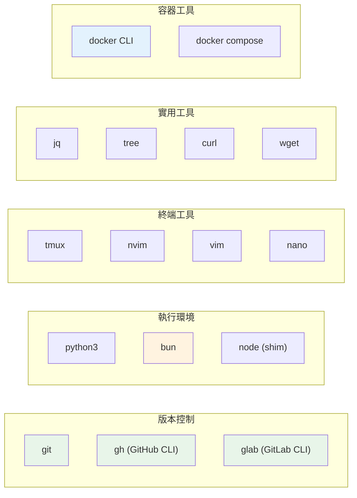

### 插件系統

| 插件 | 功能 | 說明 |
|------|------|------|
| `oh-my-opencode` | 核心框架 | OpenCode 基礎功能擴展 |
| `lancedb-opencode-pro` | 向量搜尋 | 基於 LanceDB 的程式碼索引 |

## 配置選項

### 動態安裝套件

透過環境變數可在容器啟動時安裝額外套件：

```bash
# .env
APT_PACKAGES="htop,iotop"
BREW_PACKAGES="ghq"
BUN_PACKAGES="typescript"
```

### Workspace 選項

| 模式 | 設定 | 優點 | 缺點 |
|------|------|------|------|
| Named Volume | 不設定 `WORKSPACE_PATH` (v0.5.0 預設) | 容器管理，自動初始化 git/SSH 設定 | 需要 `docker cp` 存取 |
| Bind Mount | `WORKSPACE_PATH=./workspace` | 可直接用本機 IDE 編輯 | 權限問題較常見 |
| 主機路徑 | `WORKSPACE_PATH=/home/user/projects` | 存取現有專案 | 需注意權限 |

---

> 📖 **延伸閱讀**：詳見 [TROUBLESHOOTING.md](./TROUBLESHOOTING.md) 了解常見問題。
