# Architecture Guide

This document explains the AI-EngKit system architecture, the relationships between components, and the main data flows.

## Table of Contents

- [System Overview](#system-overview)
- [Service Architecture](#service-architecture)
- [ai-admin Dashboard](#ai-admin-dashboard)
- [Domain Compose Overlay](#domain-compose-overlay)
- [Admin Agent (center connection)](#admin-agent-center-connection)
- [Container Architecture](#container-architecture)
- [Data Flow](#data-flow)
- [Network Architecture](#network-architecture)
- [Storage Architecture](#storage-architecture)
- [Startup Flow](#startup-flow)
- [Component Reference](#component-reference)

## System Overview

AI-EngKit is a Docker-based AI development environment that combines the OpenCode AI assistant (backend), the OpenChamber web UI (frontend), and a preinstalled day-to-day developer toolchain.

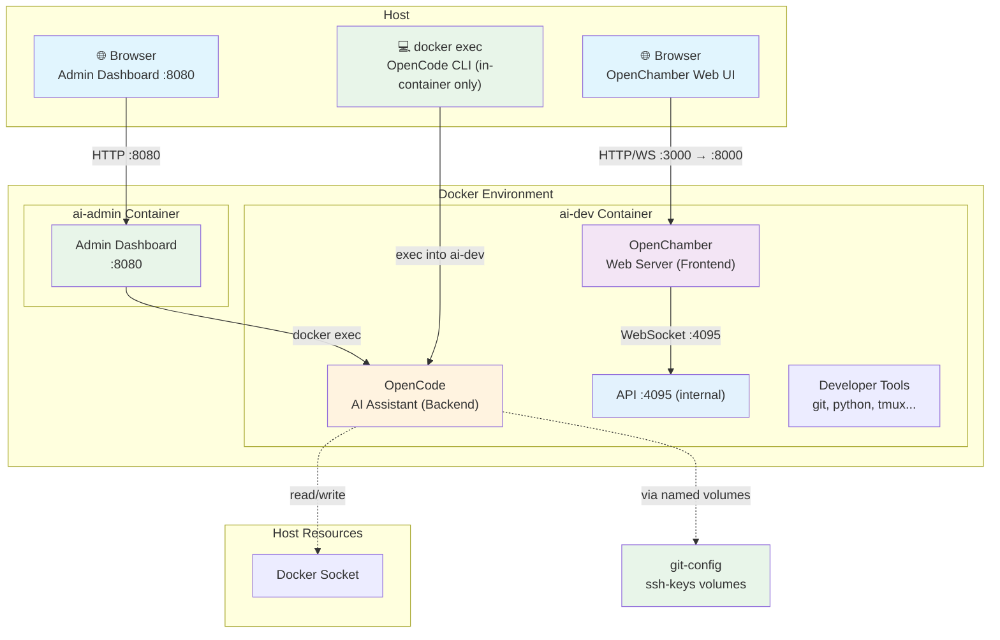
```mermaid
graph TB
    subgraph "Host"
        BROWSER["🌐 Browser<br/>OpenChamber Web UI"]
        ADMIN_BROWSER["🌐 Browser<br/>Admin Dashboard :8080"]
        DOCKER_EXEC["💻 docker exec<br/>OpenCode CLI (in-container only)"]
    end

    subgraph "Docker Environment"
        subgraph "ai-dev Container"
            OC["OpenCode<br/>AI Assistant (Backend)"]
            CH["OpenChamber<br/>Web Server (Frontend)"]
            API["API :4095 (internal)"]
            TOOLS["Developer Tools<br/>git, python, tmux..."]
        end

        subgraph "ai-admin Container"
            ADMIN["Admin Dashboard<br/>:8080"]
        end
    end

    subgraph "Host Resources"
        HOST_DOCKER["Docker Socket"]
    end

    BROWSER -->|"HTTP/WS :3000 → :8000"| CH
    CH -->|"WebSocket :4095"| API
    ADMIN_BROWSER -->|"HTTP :8080"| ADMIN
    ADMIN -->|"docker exec"| OC
    DOCKER_EXEC -->|"exec into ai-dev"| OC
    OC -.->|"via named volumes"| GIT_VOLS["git-config<br/>ssh-keys volumes"]
    OC -.->|"read/write"| HOST_DOCKER

    style BROWSER fill:#e1f5fe
    style ADMIN_BROWSER fill:#e1f5fe
    style DOCKER_EXEC fill:#e8f5e9
    style OC fill:#fff3e0
    style CH fill:#f3e5f5
    style API fill:#e3f2fd
    style ADMIN fill:#e8f5e9
    style GIT_VOLS fill:#e8f5e9
```

## Service Architecture

### Primary Services

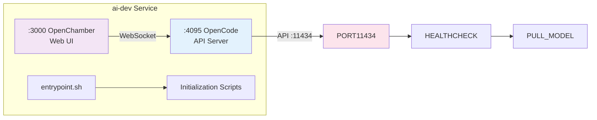
```mermaid
graph LR
    subgraph "ai-dev Service"
        direction TB
        PORT3000[":3000 OpenChamber<br/>Web UI"]
        OC_API[":4095 OpenCode<br/>API Server"]
        ENTRYPOINT["entrypoint.sh"]
        INIT_SCRIPTS["Initialization Scripts"]
    end

    PORT3000 -->|"WebSocket"| OC_API
    OC_API -->|"API :11434"| PORT11434
    ENTRYPOINT --> INIT_SCRIPTS
    PORT11434 --> HEALTHCHECK
    HEALTHCHECK --> PULL_MODEL

    style PORT3000 fill:#f3e5f5
    style OC_API fill:#e3f2fd
    style PORT11434 fill:#fce4ec
```

### Service Dependencies

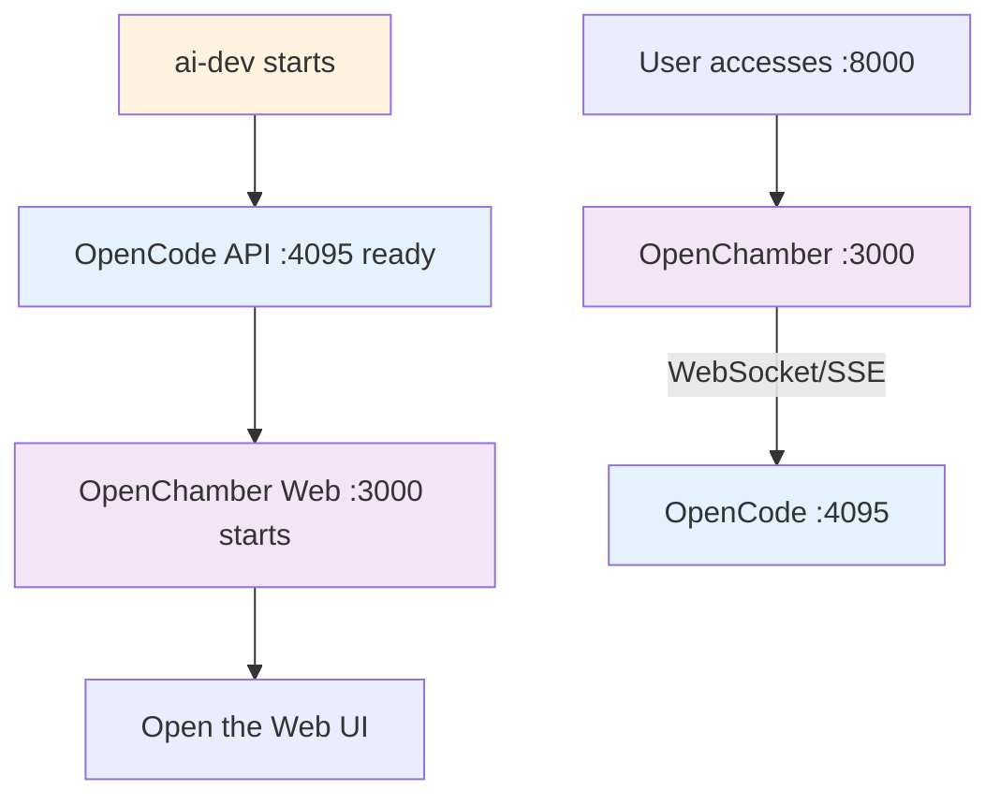
```mermaid
graph TD
    A["ai-dev starts"] --> D["OpenCode API :4095 ready"]
    D --> E["OpenChamber Web :3000 starts"]
    E --> F["Open the Web UI"]

    G["User accesses :8000"] --> H["OpenChamber :3000"]
    H -->|"WebSocket/SSE"| I["OpenCode :4095"]

    style A fill:#fff3e0
    style D fill:#e3f2fd
    style E fill:#f3e5f5
    style H fill:#f3e5f5
    style I fill:#e3f2fd
```

## ai-admin Dashboard

### Sidecar Service

ai-admin is a web-based admin dashboard shipped as a Docker sidecar service alongside the main `ai-dev` container. It runs on the same Bun runtime already present in the Docker image — **zero additional image layers**.

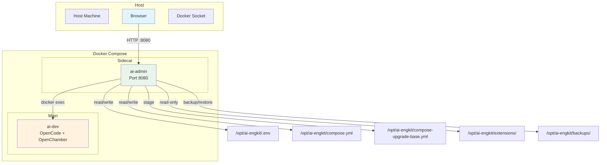
```mermaid
graph TB
    subgraph "Docker Compose"
        subgraph "Main"
            AIDEV["ai-dev<br/>OpenCode + OpenChamber"]
        end
        subgraph "Sidecar"
            AIADMIN["ai-admin<br/>Port 8080"]
        end
    end

    subgraph "Host"
        HOST["Host Machine"]
        BROWSER["Browser"]
        DOCKER_SOCK["Docker Socket"]
    end

    BROWSER -->|"HTTP :8080"| AIADMIN
    AIADMIN -->|"docker exec"| AIDEV
    AIADMIN -->|"read/write"| ENV_FILE["/opt/ai-engkit/.env"]
    AIADMIN -->|"read/write"| COMPOSE_FILE["/opt/ai-engkit/compose.yml"]
    AIADMIN -->|"stage"| STAGED_BASE["/opt/ai-engkit/compose-upgrade-base.yml"]
    AIADMIN -->|"read-only"| OVERLAY["/opt/ai-engkit/extensions/"]
    AIADMIN -->|"backup/restore"| BACKUPS["/opt/ai-engkit/backups/"]

    style AIADMIN fill:#e8f5e9
    style AIDEV fill:#fff3e0
    style BROWSER fill:#e1f5fe
```

### Features

| Feature | Endpoint | Description |
|---------|----------|-------------|
| Auth | `POST /api/login` | HMAC-signed session cookie, brute-force protection |
| Setup | `GET /setup`, `POST /api/setup` | First-run password setup with redirect |
| Version Dashboard | `GET /api/versions` | CLI and runtime version table |
| Env Config Editor | `GET /api/env`, `PUT /api/env/:key` | Inline .env editing with masked secrets |
| Upgrade Engine | `POST /api/upgrade`, `GET /api/upgrade/log` | 7-step upgrade pipeline with SSE log stream |
| Upgrade Status | `GET /api/upgrade/status` | Upgrade state and domain overlay status |
| Project Init | `GET /api/projects`, `POST /api/projects` | Project scaffold with subdomain validation |
| GitHub Auth | `POST /api/auth/gh/start`, `GET /api/auth/gh/status` | Device code flow for `gh` CLI auth |
| GitLab Auth | `POST /api/auth/glab/start`, `GET /api/auth/glab/status` | Device code flow for `glab` CLI auth |
| Git Config | `GET /api/git/config`, `PUT /api/git/config` | Git identity and credential management |
| SSH Keys | `GET /api/ssh/keys`, `POST /api/ssh/keys` | SSH key generation and public key display |
| Docker Compose | `POST /api/compose/up`, `POST /api/compose/down` | Docker compose lifecycle (DooD mode) |
| Status | `GET /api/status` | Aggregated system health summary |
| Health | `GET /healthz` | Liveness probe |
| OpenAPI | `GET /api/openapi.json` | API specification |
| LSP Server Management | `GET /lsp`, `GET /api/lsp`, `PUT /api/lsp`, `POST /api/lsp/apply` | Manage the OpenCode-facing LSP catalog, enable/pin servers, and reconcile against installed state |

### Upgrade Pipeline

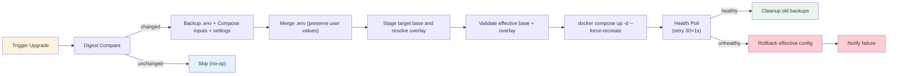
```mermaid
flowchart LR
    A["Trigger Upgrade"] --> B["Digest Compare"]
    B -->|"changed"| C["Backup .env + Compose inputs + settings"]
    C --> D["Merge .env (preserve user values)"]
    D --> E["Stage target base and resolve overlay"]
    E --> F["Validate effective base + overlay"]
    F --> G["docker compose up -d --force-recreate"]
    G --> H["Health Poll<br/>(retry 30×1s)"]
    H -->|"healthy"| I["Cleanup old backups"]
    H -->|"unhealthy"| J["Rollback effective config"]
    J --> K["Notify failure"]
    B -->|"unchanged"| L["Skip (no-op)"]

    style A fill:#fff3e0
    style I fill:#e8f5e9
    style L fill:#e3f2fd
    style J fill:#ffcdd2
    style K fill:#ffcdd2
```

### Domain Compose Overlay

The Admin sidecar keeps the upstream Compose file as the Admin-owned base and
optionally applies one domain-owned overlay configured by
`AI_ENGKIT_COMPOSE_OVERLAY`. The overlay is resolved beneath
`/opt/ai-engkit/extensions/`, validated on its own and again after merging with
the staged base, then used for Admin upgrade, ai-dev restart, database
maintenance, and other Admin-managed ai-dev recreates. With no overlay, these
paths use the historical single-file Compose flow.

Only `ai-dev` integration fields are allowed: environment, networks, named
volumes, labels, and healthcheck. The overlay cannot change the image,
container identity, ports, privilege/security settings, Docker socket mounts,
Admin service, or domain worker lifecycle. The Admin API reports overlay
status; the detailed ownership and validation contract is in
[Domain Compose Overlay](./DOMAIN_COMPOSE_OVERLAY.md).

### Key Decisions

| Decision | Rationale |
|----------|-----------|
| Bun runtime (no extra layers) | Bun is already installed for the OpenCode server |
| `working_dir: /opt/admin` required | `tsconfig.json` at `/opt/admin/` configures Hono JSX runtime; Bun finds it via CWD |
| HMAC session cookies over JWT | No dependency on JWK/JWKS; ADMIN_PASSWORD as shared secret |
| HMAC session cookies over JWT | No dependency on JWK/JWKS; ADMIN_PASSWORD as shared secret |
| SSE over WebSocket logs | Simpler server-sent protocol, no bidirectional channel needed |
| DooD (Docker-out-of-Docker) | Reuses the host Docker socket already passed to the container |
| `/opt/ai-engkit/` host paths | Isolates operational files (`.env`, `compose.yml`, staged base, overlay, and `backups/`) from user workspace |

### Environment Variables

| Variable | Default | Description |
|----------|---------|-------------|
| `ADMIN_PORT` | `8080` | Host port for the admin dashboard |
| `ADMIN_DEV_PORT` | `8081` | Dev mode port (with `--watch`) |
| `ADMIN_PASSWORD` | *(required)* | Admin login password (prompted by `install.sh`) |
| `AI_ENGKIT_COMPOSE_OVERLAY` | *(empty — disabled)* | One operator-controlled overlay beneath `/opt/ai-engkit/extensions/` |
| `CENTER_URL` | *(empty — disabled)* | WebSocket URL of the AI-EngKit-Manager center |
| `CENTER_TOKEN` | *(empty)* | Registration token for center authentication |
| `AGENT_ID` | *(auto-generated)* | Agent identifier sent during handshake |
| `CENTER_TLS_CA` | *(empty)* | Path to CA PEM for mTLS to center |
| `CENTER_TLS_CERT` | *(empty)* | Path to client cert PEM for mTLS |
| `CENTER_TLS_KEY` | *(empty)* | Path to client key PEM for mTLS |

### LSP Server Management

The ai-admin dashboard manages the OpenCode-facing language servers (the `lsp` block of the generated `opencode.json`) from a typed **catalog** in `src/admin/lib/lsp-catalog.ts`. Supported servers are known/shipped with the image; the catalog declares the npm package, the binary command, the file extensions it serves, and whether it is enabled by default.

User intent is expressed as a structured JSON override var in `.env`:

```bash
# .env — LSP_SERVERS overrides the baseline catalog; absent = default (unpinned, disabled unless default-enabled)
LSP_SERVERS='{"typescript":{"enabled":true,"version":"6.0.0"},"biome":{"enabled":true,"version":null}}'
```

- `version: null` means *latest (unpinned)*; a concrete version pins that exact release.
- A missing/unknown key falls back to the catalog baseline — except built-in-backed servers (`typescript`, `yaml-ls`, `pyright`), whose `enabled:false` is normalized to managed (`true`).
- No `LSP_SERVERS` at all ⇒ non-backed servers disabled/unpinned; backed servers resolve to managed.

Installation rides the existing startup package mechanism. `src/admin/lib/lsp-reconciler.ts` computes the **desired** set (catalog + overrides) against the **observed** state (globally installed npm versions + the generated `lsp` block), reporting drift per server:

- `missing_install` — an enabled server is not installed;
- `version_mismatch` — an enabled pinned server's installed version differs;
- `not_enabled_in_lsp` — an enabled server is missing from the `lsp` block.

The Admin **LSP Servers** page (`views/lsp.tsx`, mounted under the auth guard at `/lsp`) lists the catalog with live observed state, lets the operator enable servers and pin versions (choosing from registry-discovered versions, newest first with an incremental "Show more"), and triggers an **apply** (`POST /api/lsp/apply`) that installs changed servers via `bun install -g` through `BUN_PACKAGES` and merges the enabled servers into the generated `opencode.json` `lsp` block. On failure the persisted `.env` state is left unchanged. On every successful apply the Admin also pushes both vars to `lsp-managed.env` in the opencode-config volume, and `entrypoint.d/02-init-config.sh` regenerates the `lsp` block at startup from the enabled entries, reading `BUN_PACKAGES`/`LSP_SERVERS` from that file only when the container environment does not already define them.

---

## Admin Agent (center connection)

### Overview

The Admin Agent is an **outbound WebSocket client** built into `ai-admin` that allows a remote AI-EngKit-Manager (center) to manage one or more AI-EngKit instances. It is **disabled by default** — activated only when `CENTER_URL` is set.

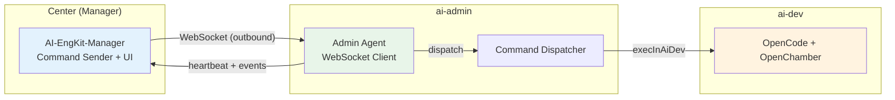
```mermaid
graph LR
    subgraph "Center (Manager)"
        MANAGER["AI-EngKit-Manager<br/>Command Sender + UI"]
    end

    subgraph "ai-admin"
        AGENT["Admin Agent<br/>WebSocket Client"]
        DISPATCHER["Command Dispatcher"]
    end

    subgraph "ai-dev"
        AIDEV["OpenCode + OpenChamber"]
    end

    MANAGER -->|"WebSocket (outbound)"| AGENT
    AGENT -->|"dispatch"| DISPATCHER
    DISPATCHER -->|"execInAiDev"| AIDEV
    AGENT -->|"heartbeat + events"| MANAGER

    style MANAGER fill:#e3f2fd
    style AGENT fill:#e8f5e9
    style AIDEV fill:#fff3e0
```

### Connection model

| Aspect | Detail |
|--------|--------|
| Direction | **Outbound** from ai-admin to center (no inbound port opened) |
| Transport | WebSocket (`ws://` or `wss://`) |
| Activation | `CENTER_URL` env var; empty/absent → agent disabled |
| Authentication | Registration token via `?token=` query param or `CENTER_TOKEN` env var |
| TLS | Optional mTLS via `CENTER_TLS_CA`, `CENTER_TLS_CERT`, `CENTER_TLS_KEY` env vars, or `ca` query param (base64url-encoded PEM) |
| Reconnection | Exponential backoff with jitter; resets on successful handshake |
| Heartbeat | Periodic status reports (container health, versions, upgrade state, auth status) |

### Command protocol

The center sends **commands**; the agent dispatches them to shared libraries already used by the local admin UI. Each command returns an **ack** (immediate acceptance) and optionally a **result** (final outcome).

#### Commands (center → agent)

| Command | Description |
|---------|-------------|
| `upgrade` | Trigger the 7-step upgrade pipeline |
| `reconfigure` | Restart ai-dev with updated config |
| `restart` | Restart ai-dev container |
| `providers.key.add` | Add an API key for a provider |
| `providers.key.set-active` | Switch the active provider key |
| `providers.key.delete` | Remove a provider key |
| `providers.key.update-note` | Update key note/label |
| `secrets.set` | Update passwords (reports activation status) |
| `ssh.key.add` | Generate or import an SSH key |
| `ssh.key.delete` | Remove an SSH key |
| `git.config.set` | Update global git config |
| `gh.auth.start` | Start GitHub device-code auth flow |
| `gh.auth.logout` | Disconnect GitHub auth |
| `glab.instance.add` | Add a GitLab instance |
| `glab.instance.remove` | Remove a GitLab instance |
| `projects.create` | Create or clone a project |
| `projects.set-remote` | Set project git remote |
| `projects.enable` / `disable` | Enable/disable a project |
| `projects.enable-feature` | Enable a project feature |
| `projects.sync` | Sync project list (add/remove) |
| `agent-models.set` | Switch the active agent model |

#### Queries (center → agent, read-only)

| Query | Returns |
|-------|---------|
| `status` | Aggregated health, auth, versions, upgrade state |
| `env.get` | Masked environment variables |
| `projects.list` | Project list with lean-ctx status |
| `providers.list` | Provider definitions and key metadata |
| `git.config.get` | Masked global git config |
| `glab.instances` | GitLab instances (hostname, username, auth status) |
| `ssh.key.list` | SSH key names, types, fingerprints |
| `agent-models.list` | Available agent models |

#### Events (agent → center, fire-and-forget)

| Event | Payload |
|-------|---------|
| `upgrade` | Real-time upgrade pipeline progress (step, status, message) |

### Security model

- All command logic is **shared** with the local admin routes — identical behavior whether triggered locally or remotely.
- Secret material (PATs, passwords, device codes) is **never echoed** outside the command payload; the only outbound occurrence is `gh.auth.start` ack `data` carrying the device code.
- `git.config.get` drops `credential.*` and `url.*` entries; remaining values matching `KEY_MATERIAL_PATTERN` are masked.
- `glab.instances` omits tokens by construction; `ssh.key.list` returns only name/type/fingerprint.
- The agent connection is **outbound only** — no additional ports are opened on the host.

### Key files

| File | Purpose |
|------|---------|
| `src/admin/agent/client.ts` | WebSocket lifecycle, reconnection, heartbeat |
| `src/admin/agent/protocol.ts` | Envelope format, command/query name whitelist, message builders |
| `src/admin/agent/commands.ts` | Command dispatcher, handler registration |
| `src/admin/agent/heartbeat.ts` | Status report builder, heartbeat interval |
| `src/admin/agent/auth.ts` | Registration token resolution |
| `src/admin/agent/tls.ts` | TLS/mTLS configuration |
| `src/admin/agent/backoff.ts` | Exponential backoff with jitter |

---

## Container Architecture

### ai-dev Internal Layout

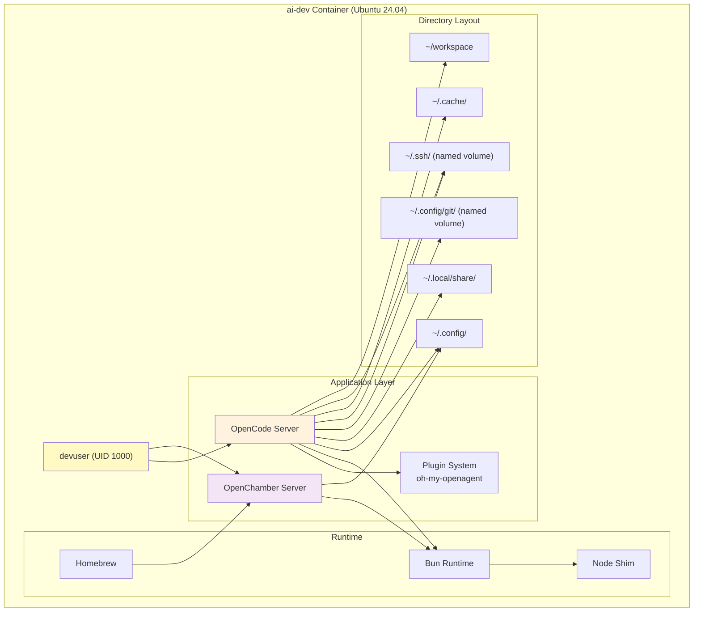
```mermaid
graph TB
    subgraph "ai-dev Container (Ubuntu 24.04)"
        USER["devuser (UID 1000)"]

        subgraph "Application Layer"
            OC_SERVER["OpenCode Server"]
            OC_PLUGINS["Plugin System<br/>oh-my-openagent"]
            CH_SERVER["OpenChamber Server"]
        end

        subgraph "Runtime"
            BUN["Bun Runtime"]
            HOMEBREW["Homebrew"]
            NODE_SHIM["Node Shim"]
        end

        subgraph "Directory Layout"
            WORKSPACE["~/workspace"]
            CONFIG["~/.config/"]
            DATA["~/.local/share/"]
            CACHE["~/.cache/"]
            SSH["~/.ssh/ (named volume)"]
            GIT["~/.config/git/ (named volume)"]
        end
    end

    USER --> OC_SERVER
    USER --> CH_SERVER
    OC_SERVER --> OC_PLUGINS
    OC_SERVER --> BUN
    CH_SERVER --> BUN
    BUN --> NODE_SHIM
    HOMEBREW --> CH_SERVER

    OC_SERVER --> CONFIG
    OC_SERVER --> DATA
    OC_SERVER --> GIT
    OC_SERVER --> SSH
    OC_SERVER --> CACHE
    CH_SERVER --> CONFIG
    OC_SERVER --> SSH
    OC_SERVER --> WORKSPACE

    style USER fill:#fff9c4
    style OC_SERVER fill:#fff3e0
    style CH_SERVER fill:#f3e5f5
```

## Data Flow

### AI Conversation Flow

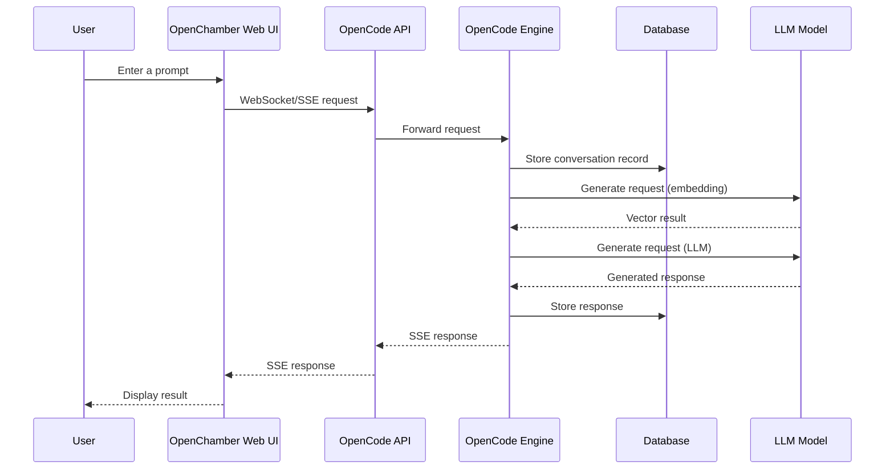
```mermaid
sequenceDiagram
    participant U as User
    participant UI as OpenChamber Web UI
    participant API as OpenCode API
    participant OC as OpenCode Engine
    participant DB as Database
    participant OL as LLM Model

    U->>UI: Enter a prompt
    UI->>API: WebSocket/SSE request
    API->>OC: Forward request
    OC->>DB: Store conversation record
    OC->>OL: Generate request (embedding)
    OL-->>OC: Vector result
    OC->>OL: Generate request (LLM)
    OL-->>OC: Generated response
    OC->>DB: Store response
    OC-->>API: SSE response
    API-->>UI: SSE response
    UI-->>U: Display result
```

## Network Architecture

### Container Network Topology

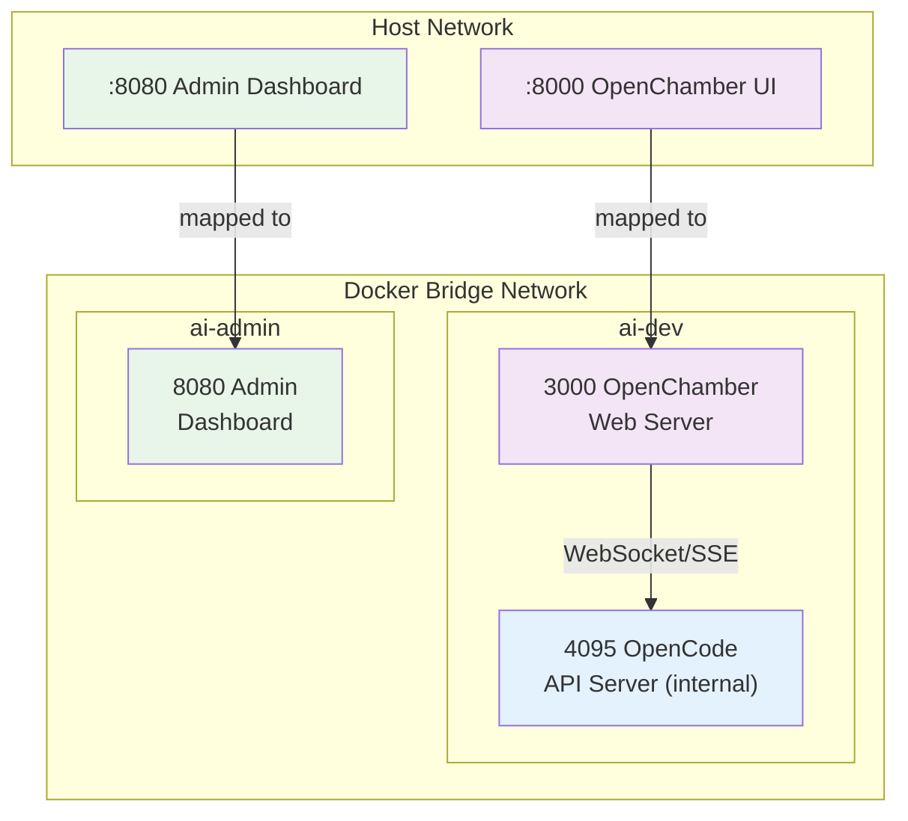
```mermaid
graph TB
    subgraph "Host Network"
        HOST_PORT_8000[":8000 OpenChamber UI"]
        HOST_PORT_8080[":8080 Admin Dashboard"]
    end

    subgraph "Docker Bridge Network"
        subgraph "ai-dev"
            CONTAINER_3000["3000 OpenChamber<br/>Web Server"]
            CONTAINER_4095["4095 OpenCode<br/>API Server (internal)"]
        end

        subgraph "ai-admin"
            CONTAINER_8080["8080 Admin<br/>Dashboard"]
        end
    end

    HOST_PORT_8000 -->|"mapped to"| CONTAINER_3000
    HOST_PORT_8080 -->|"mapped to"| CONTAINER_8080

    CONTAINER_3000 -->|"WebSocket/SSE"| CONTAINER_4095

    style HOST_PORT_8000 fill:#f3e5f5
    style HOST_PORT_8080 fill:#e8f5e9
    style CONTAINER_3000 fill:#f3e5f5
    style CONTAINER_4095 fill:#e3f2fd
    style CONTAINER_8080 fill:#e8f5e9
```

When `AI_ENGKIT_COMPOSE_OVERLAY` is configured, `ai-dev` may also attach to
domain-owned external networks declared by the overlay. The domain project
creates and manages those networks and its worker services; AI-EngKit only
recreates `ai-dev` with the effective base-plus-overlay configuration.

### Environment Variables

| Variable | Purpose | Default | Scope |
|------|------|--------|------|
| `CHAMBER_PORT` | Web UI port | 8000 | Host |
| `OPENCODE_SERVER_PASSWORD` | API authentication | `devonly` | Application |
| `OPENCHAMBER_UI_PASSWORD` | Web UI authentication | `chamber` | Application |
| `AI_ENGKIT_COMPOSE_OVERLAY` | Domain Compose overlay | *(empty — disabled)* | Admin / Compose |

## Storage Architecture

### Volume Configuration


```mermaid
graph TB
    subgraph "Docker Volumes"
        VOL_WS["workspace<br/>Project files"]
        VOL_DATA["opencode-data<br/>Database"]
        VOL_CONFIG["opencode-config<br/>Configuration"]
        VOL_CACHE["opencode-cache<br/>Cache"]
        VOL_OHMY["ohmyopencode-cache<br/>Plugin cache"]
        VOL_CHAMBER["openchamber-data<br/>UI settings"]
        VOL_GIT["git-config<br/>Git settings"]
        VOL_SSH["ssh-keys<br/>SSH keys"]
        VOL_GH["gh-config<br/>GitHub CLI settings"]
        VOL_GLAB["glab-config<br/>GitLab CLI settings"]
        VOL_LC_DATA["lean-ctx-data<br/>Vector index / knowledge base"]
        VOL_LC_STATE["lean-ctx-state<br/>Event logs"]
    end

    subgraph "Container Paths"
        C_WS["~/workspace"]
        C_DATA["~/.local/share/opencode"]
        C_LC_DATA["~/.local/share/lean-ctx"]
        C_LC_STATE["~/.local/state/lean-ctx"]
        C_CONFIG["~/.config/opencode"]
        C_CACHE["~/.cache/opencode"]
        C_OHMY["~/.cache/oh-my-opencode"]
        C_CHAMBER["~/.config/openchamber"]
        C_GIT["~/.config/git<br/>~/.gitconfig"]
        C_SSH["~/.ssh"]
        C_GH["~/.config/gh"]
        C_GLAB["~/.config/glab-cli"]
    end

    VOL_WS --> C_WS
    VOL_DATA --> C_DATA
    VOL_CONFIG --> C_CONFIG
    VOL_CACHE --> C_CACHE
    VOL_OHMY --> C_OHMY
    VOL_CHAMBER --> C_CHAMBER
    VOL_GIT --> C_GIT
    VOL_SSH --> C_SSH
    VOL_GH --> C_GH
    VOL_GLAB --> C_GLAB
    VOL_LC_DATA --> C_LC_DATA
    VOL_LC_STATE --> C_LC_STATE

    style VOL_WS fill:#fff3e0
    style VOL_DATA fill:#e3f2fd
    style VOL_GIT fill:#e8f5e9
    style VOL_SSH fill:#e8f5e9
    style VOL_GH fill:#e8f5e9
    style VOL_GLAB fill:#e8f5e9
```

### Persistence Strategy

| Data Type | Storage Location | Retention | Backup Recommendation |
|---------|---------|---------|---------|
| Project files | workspace | Critical | Back up regularly to Git |
| Conversation history | opencode-data | Critical | Export regularly |
| User configuration | opencode-config | Critical | Keep under version control |
| Git settings | git-config | Critical | Includes `.gitconfig`, `.git-credentials` |
| SSH keys | ssh-keys | Critical | Includes `known_hosts` |
| GitHub CLI settings | gh-config | Critical | Includes host auth and cache |
| GitLab CLI settings | glab-config | Critical | Includes host auth and cache |
| Cache data | opencode-cache | Rebuildable | No backup needed |
| UI settings | openchamber-data | Normal | No backup needed |
| lean-ctx vector index / knowledge base | lean-ctx-data | Critical | Includes sessions, vectors, graphs, knowledge |
| lean-ctx event logs / state | lean-ctx-state | Normal | Includes events, journal, agent keys |

## Startup Flow

### Container Startup Order

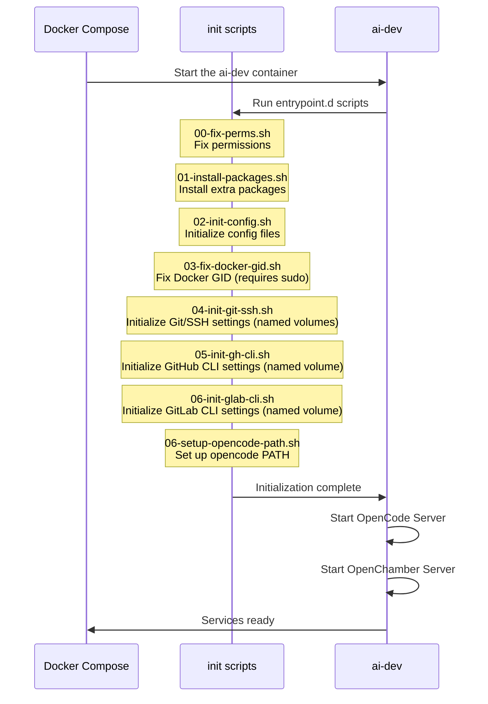
```mermaid
sequenceDiagram
    participant D as Docker Compose
    participant I as init scripts
    participant A as ai-dev

    D->>A: Start the ai-dev container
    A->>I: Run entrypoint.d scripts

    Note over I: 00-fix-perms.sh<br/>Fix permissions

    Note over I: 01-install-packages.sh<br/>Install extra packages

    Note over I: 02-init-config.sh<br/>Initialize config files

    Note over I: 03-fix-docker-gid.sh<br/>Fix Docker GID (requires sudo)

    Note over I: 04-init-git-ssh.sh<br/>Initialize Git/SSH settings (named volumes)

    Note over I: 05-init-gh-cli.sh<br/>Initialize GitHub CLI settings (named volume)

    Note over I: 06-init-glab-cli.sh<br/>Initialize GitLab CLI settings (named volume)

    Note over I: 06-setup-opencode-path.sh<br/>Set up opencode PATH

    I->>A: Initialization complete
    A->>A: Start OpenCode Server
    A->>A: Start OpenChamber Server
    A->>D: Services ready
```

### Initialization Script Order

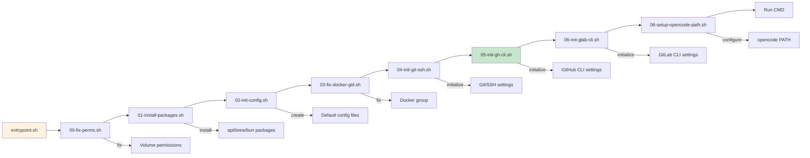
```mermaid
flowchart LR
    A["entrypoint.sh"] --> B["00-fix-perms.sh"]
    B --> C["01-install-packages.sh"]
    C --> D["02-init-config.sh"]
    D --> E["03-fix-docker-gid.sh"]
    E --> F["04-init-git-ssh.sh"]
    F --> G["05-init-gh-cli.sh"]
    G --> GA["06-init-glab-cli.sh"]
    GA --> GB["06-setup-opencode-path.sh"]
    GB --> H["Run CMD"]

    B -->|"fix"| PERMS["Volume permissions"]
    C -->|"install"| PKGS["apt/brew/bun packages"]
    D -->|"create"| CONFIGS["Default config files"]
    E -->|"fix"| DOCKER["Docker group"]
    F -->|"initialize"| GITSETUP["Git/SSH settings"]
    G -->|"initialize"| GH_SETUP["GitHub CLI settings"]
    GA -->|"initialize"| GLAB_SETUP["GitLab CLI settings"]
    GB -->|"configure"| PATH_SETUP["opencode PATH"]

    style A fill:#fff3e0
    style G fill:#c8e6c9
```

## Component Reference

### OpenCode

| Attribute | Description |
|------|------|
| Purpose | AI coding assistant (backend engine) |
| Version | See `ARG OPENCODE_VERSION` in `Dockerfile` |
| Config file | `~/.config/opencode/opencode.json` |
| Database | `~/.local/share/opencode/opencode.db` |
| API port | 4095 |
| Protocol | HTTP + SSE (Server-Sent Events) |
| SDK | `@opencode-ai/sdk` |

### OpenChamber

| Attribute | Description |
|------|------|
| Purpose | Web/Desktop UI for OpenCode (frontend GUI) |
| Version | See `ARG OPENCHAMBER_VERSION` in `Dockerfile` |
| Relationship to OpenCode | Separate project that connects to OpenCode over API |
| Service port | 3000 (mapped to host port 8000) |
| Transport | WebSocket (terminal) + SSE (chat) |
| Frontend framework | React (Tauri for desktop) |

> 📝 **Architecture note**: OpenChamber is not part of OpenCode. It is a separate project ([openchamber/openchamber](https://github.com/openchamber/openchamber)) that acts as a client and connects to the OpenCode server through `@opencode-ai/sdk/v2`, either by starting a local server automatically or by connecting to a remote one.

### Developer Toolchain

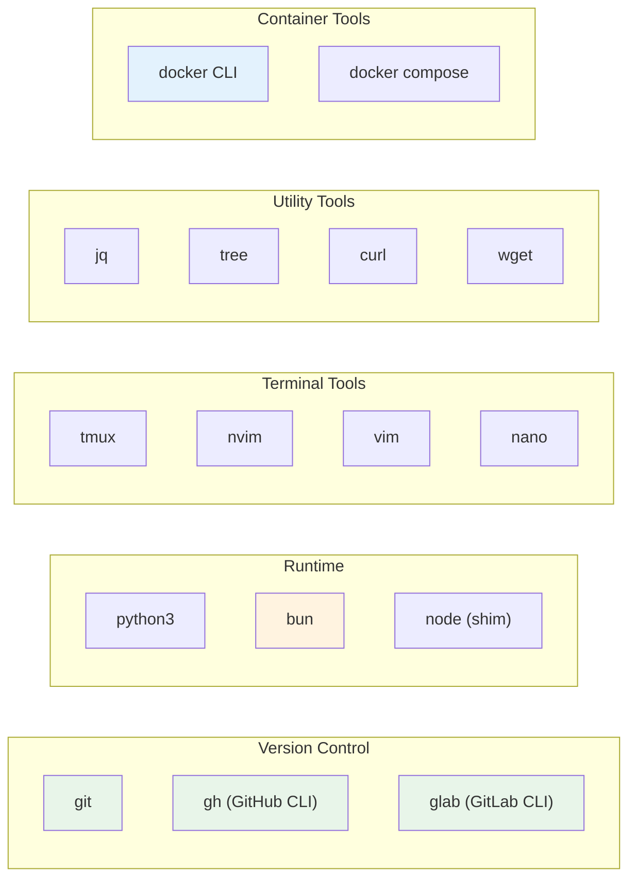
```mermaid
graph LR
    subgraph "Version Control"
        GIT["git"]
        GH["gh (GitHub CLI)"]
        GLAB["glab (GitLab CLI)"]
    end

    subgraph "Runtime"
        PYTHON["python3"]
        BUN["bun"]
        NODE["node (shim)"]
    end

    subgraph "Terminal Tools"
        TMUX["tmux"]
        NEOVIM["nvim"]
        VIM["vim"]
        NANO["nano"]
    end

    subgraph "Utility Tools"
        JQ["jq"]
        TREE["tree"]
        CURL["curl"]
        WGET["wget"]
    end

    subgraph "Container Tools"
        DOCKER["docker CLI"]
        COMPOSE["docker compose"]
    end

    style GIT fill:#e8f5e9
    style GH fill:#e8f5e9
    style GLAB fill:#e8f5e9
    style BUN fill:#fff3e0
    style DOCKER fill:#e3f2fd
```

### Plugin System

| Plugin | Purpose | Description | Version Management |
| `oh-my-openagent` | Core framework | Extends baseline OpenCode functionality | Build-time pin via `OH_MY_OPENAGENT_VERSION` |

### Plugin Version Management (Development)

`AI_ENGKIT_VERSION` and `OH_MY_OPENAGENT_VERSION` control different things:
`AI_ENGKIT_VERSION` selects the deployed AI-EngKit image and remains `latest`
by default in the production Compose file. `OH_MY_OPENAGENT_VERSION` selects
the OMO plugin version baked into a development image's default OpenCode
configuration; the Dockerfile default is `4.19.4`.

You can override the OMO version when building the development image:

```bash
# Use the Dockerfile default (`4.19.4`)
docker compose -p dev -f docker-compose.dev.yml build

# Pin a specific OMO version
OH_MY_OPENAGENT_VERSION=3.15.0 \
  docker compose -p dev -f docker-compose.dev.yml build
```

## Configuration Options

### Dynamic Package Installation

Install extra packages at container startup through environment variables:

```bash
# .env
APT_PACKAGES="htop,iotop"
BREW_PACKAGES="ghq"
BUN_PACKAGES="typescript"
```

### Workspace Options

| Mode | Setting | Advantages | Drawbacks |
|------|------|------|------|
| Named Volume | Leave `WORKSPACE_PATH` unset (default since v0.5.0) | Managed by Docker, auto-initializes Git/SSH settings | Requires `docker cp` for direct host access |
| Bind Mount | `WORKSPACE_PATH=./workspace` | Editable directly with a local IDE | Permission issues are more common |
| Host Path | `WORKSPACE_PATH=/home/user/projects` | Reuses an existing project directory | Requires careful permission management |

---

> 📖 **Further reading**: See [TROUBLESHOOTING.md](./TROUBLESHOOTING.md) for common issues.
