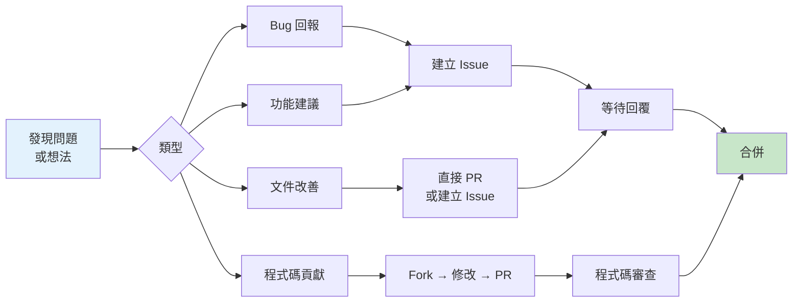
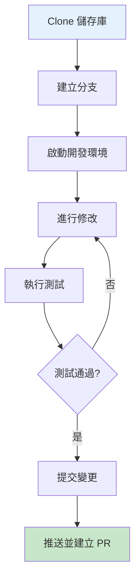
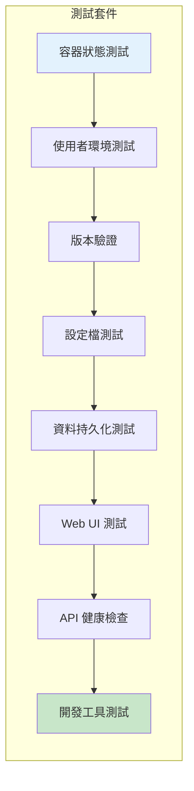
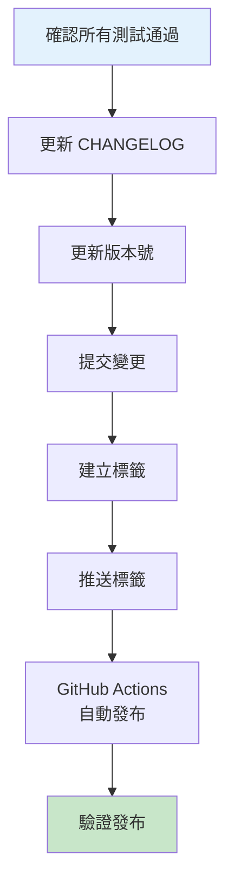

# 貢獻指南

感謝您考慮為 ai-engkit 專案貢獻！本文檔說明如何參與開發。

## 目錄

- [行為準則](#行為準則)
- [如何貢獻](#如何貢獻)
- [開發環境設置](#開發環境設置)
- [提交 Issue](#提交-issue)
- [提交 Pull Request](#提交-pull-request)
- [程式碼規範](#程式碼規範)
- [測試](#測試)
- [發布流程](#發布流程)

## 行為準則

貢獻時請遵守以下原則：

- **尊重**：對所有參與者保持尊重
- **建設性**：提供有建設性的回饋
- **包容性**：歡迎不同背景的貢獻者
- **專業性**：保持專業的溝通方式

## 如何貢獻



### 貢獻類型

| 類型 | 說明 | 是否需要 Issue |
|------|------|---------------|
| 🐛 Bug 修復 | 修復已知問題 | ✅ 先建立 Issue |
| ✨ 新功能 | 新增功能 | ✅ 先建立 Issue |
| 📝 文件 | 改善文件 | ❌ 可直接 PR |
| 🎨 重構 | 改善程式碼結構 | ✅ 先建立 Issue |
| 🔧 配置 | 更新配置範例 | ❌ 可直接 PR |

## 開發環境設置

### 前置需求

- Git
- Docker 與 Docker Compose
- 文字編輯器（建議使用支援 Docker 的 IDE）

### 設置步驟



```bash
# 1. Fork 並 Clone 儲存庫
git clone https://github.com/YOUR_USERNAME/ai-engkit.git
cd ai-engkit

# 2. 加入上游儲存庫（選擇性）
git remote add upstream https://github.com/tryweb/ai-engkit.git

# 3. 建立功能分支
git checkout -b feature/your-feature-name

# 4. 設定環境變數
cp .env.example .env
# 編輯 .env 進行必要設定

# 5. 啟動開發環境
docker compose -f docker-compose.dev.yml build --no-cache
docker compose -f docker-compose.dev.yml up -d

# 6. 確認服務運行
docker compose -f docker-compose.dev.yml ps
curl http://localhost:8000/health
```

### 開發工作流程

```bash
# 拉取最新變更
git fetch upstream
git rebase upstream/main

# 執行測試
./test/run-tests.sh

# 查看容器日誌
docker compose -f docker-compose.dev.yml logs -f ai-dev

# 進入容器調試
docker compose -f docker-compose.dev.yml exec ai-dev bash
```

## 提交 Issue

### Bug 回報模板

```markdown
## 問題描述
簡潔說明發生的問題。

## 重現步驟
1. 執行 '...'
2. 點擊 '...'
3. 捲動到 '...'
4. 看到錯誤

## 預期行為
說明您預期應該發生什麼。

## 畫面截圖
如果適用，請附加畫面截圖。

## 環境資訊
- 作業系統：[例如 Ubuntu 22.04]
- Docker 版本：[例如 24.0.5]
- Docker Compose 版本：[例如 2.24.5]
- 映像檔標籤：[例如 latest, v1.0.0]

## 日誌輸出
```
請在此貼上相關日誌
```

## 額外資訊
任何其他相關資訊。
```

### 功能請求模板

```markdown
## 功能描述
簡潔說明您想要的功能。

## 使用情境
說明這個功能解決什麼問題。

## 建議的解決方案
說明您認為如何實作。

## 替代方案
您考慮過的其他解決方案。

## 額外資訊
任何其他相關資訊或畫面截圖。
```

## 提交 Pull Request

### PR 檢查清單

提交 PR 前，請確認：

- [ ] 程式碼符合專案風格
- [ ] 已新增或更新相關文件
- [ ] 已通過所有測試
- [ ] 已在本地環境測試
- [ ] Commit 訊息清晰明瞭
- [ ] 分支已合併最新 main

### PR 命名規範

```
類型(範圍): 簡短描述

例如：
feat(docker): 新增 GPU 支援
fix(core): 修正記憶體洩漏問題
docs(security): 新增安全政策文件
```

### PR 類型

| 類型 | 前綴 | 說明 |
|------|------|------|
| 新功能 | `feat:` | 新增功能 |
| Bug 修復 | `fix:` | 修復 Bug |
| 文件 | `docs:` | 文件變更 |
| 程式碼格式 | `style:` | 格式調整（不影響邏輯） |
| 重構 | `refactor:` | 重構（不新增功能、不修復 Bug） |
| 測試 | `test:` | 新增或修改測試 |
| 建置 | `build:` | 建置系統或外部依賴變更 |
| CI/CD | `ci:` | CI 設定變更 |
| 其他 | `chore:` | 其他變更 |

## 程式碼規範

### Shell 腳本規範

```bash
#!/usr/bin/env bash
set -euo pipefail

# 函數定義使用 snake_case
my_function() {
    local param="$1"
    echo "Hello, ${param}"
}

# 變數使用大寫
MY_VARIABLE="value"

# 使用 [[ ]] 而非 [ ]
if [[ -f "$file" ]]; then
    echo "File exists"
fi

# 錯誤處理
command || {
    echo "Command failed" >&2
    exit 1
}
```

### Docker 相關規範

```yaml
# docker-compose.yml 規範
services:
  my-service:
    image: official/image:version  # 使用官方映像
    container_name: descriptive-name
    environment:
      - VAR_NAME=${VAR:-default}  # 使用環境變數
    volumes:
      - named-volume:/path  # 優先使用命名 Volume
    restart: unless-stopped  # 除非手動停止，否則重啟
    healthcheck:  # 必須有健康檢查
      test: ["CMD", "curl", "-f", "http://localhost:3000/health"]
      interval: 10s
      timeout: 5s
      retries: 3
```

### Markdown 規範

- 標題層級不要跳躍（h1 → h2 → h3）
- 程式碼區塊要指定語言
- 表格對齊
- 使用繁體中文

### Mermaid 圖表規範

```mermaid
# 使用清晰的節點標籤
flowchart LR
    A["清晰的標籤"] --> B["另一個標籤"]
    B --> C["結論"]

    # 使用樣式突顯重要節點
    style A fill:#e3f2fd
    style C fill:#c8e6c9
```

## 測試

### 執行測試

```bash
# 基本測試（需要容器已運行）
./test/run-tests.sh

# 完整測試（包含建置）
./test/test-full.sh

# 指定容器名稱
./test/run-tests.sh my-container
```

### 測試結構



### 新增測試

在 `test/run-tests.sh` 中新增測試：

```bash
# 在適當的 section 中加入
echo "--- 新的測試區塊 ---"

# 使用現有的斷言函數
assert_eq "描述" "預期值" "實際值"
assert_contains "描述" "要包含的字串" " haystack"
assert_file_exists "描述" "/path/to/file"
assert_dir_exists "描述" "/path/to/dir"
```

## 發布流程

### 版本號規範

使用 [語義化版本](https://semver.org/lang/zh-TW/)：

```
主版本.次版本.修訂版本

- 主版本：不相容的 API 變更
- 次版本：新增功能（向下相容）
- 修訂版本：Bug 修復（向下相容）
```

### 發布步驟



```bash
# 1. 確認測試通過
./test/run-tests.sh

# 2. 更新版本號（在 Dockerfile 中）
# ARG OPENCODE_VERSION=x.y.z
# ARG OPENCHAMBER_VERSION=x.y.z

# 3. 更新 CHANGELOG
# 記錄本次變更

# 4. 提交
git add -A
git commit -m "chore: prepare release v1.2.3"

# 5. 建立標籤
git tag -a v1.2.3 -m "Release v1.2.3"

# 6. 推送
git push origin main --tags
```

## 授權

貢獻的程式碼將依據本專案的 [MIT License](../LICENSE) 授權條款發布。

---

> 💡 **提示**：有任何問題歡迎在 Issue 中討論，或聯繫維護者：tryweb@ichiayi.com
