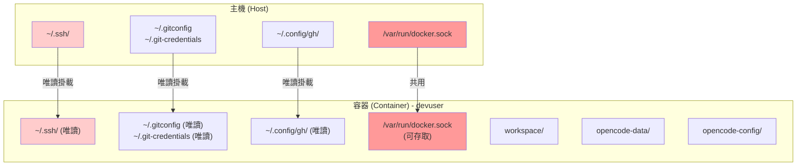
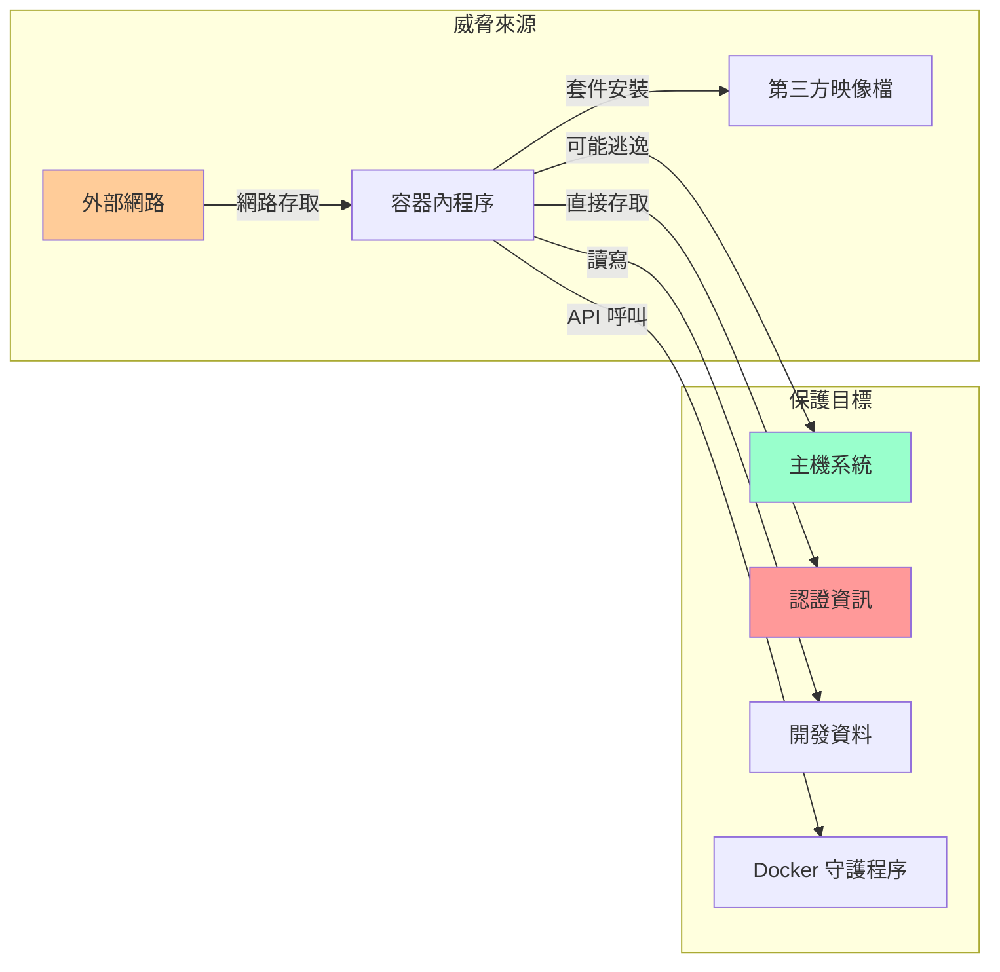
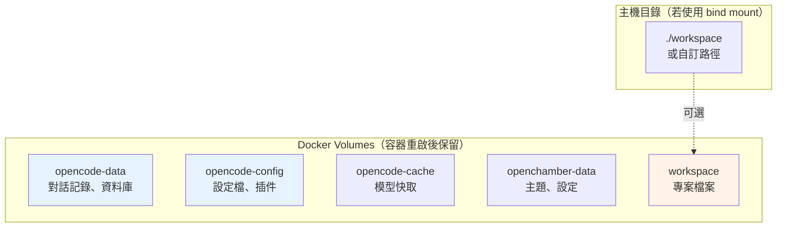
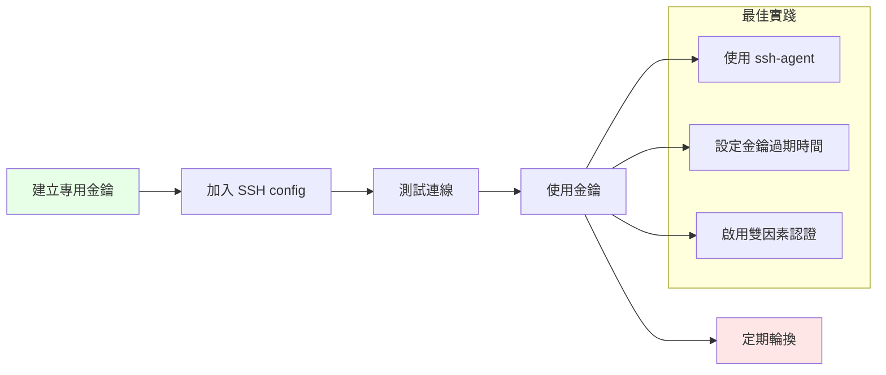
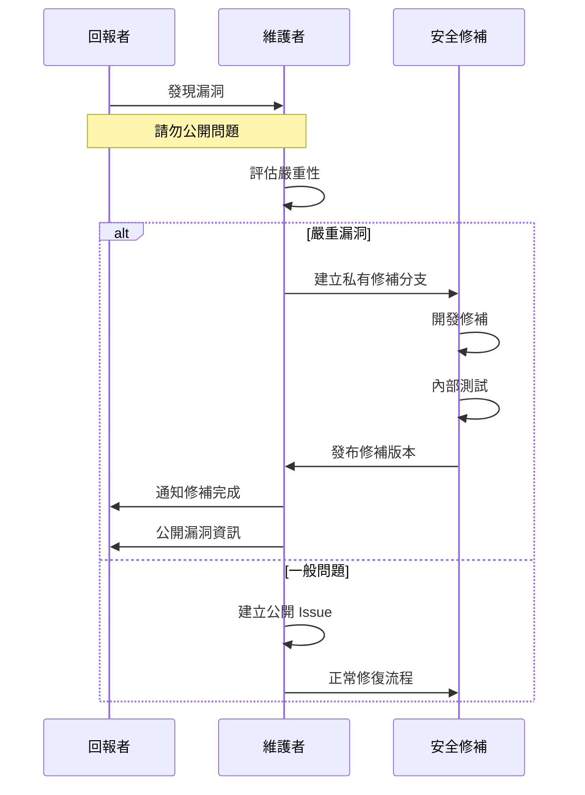

# 安全政策

本文檔說明 OpenChamber 專案的安全考量、風險評估及最佳實踐。

## 目錄

- [安全架構](#安全架構)
- [風險評估矩陣](#風險評估矩陣)
- [資料存取範圍](#資料存取範圍)
- [安全最佳實踐](#安全最佳實踐)
- [漏洞回報流程](#漏洞回報流程)
- [安全設定檢查清單](#安全設定檢查清單)

## 安全架構

### 系統權限架構



### 安全威脅模型



## 風險評估矩陣

| 風險項目 | 嚴重性 | 可能性 | 風險等級 | 緩解措施 |
|---------|--------|--------|---------|---------|
| Docker socket 存取 | 高 | 中 | 🔴 高 | 僅在信任環境使用 |
| SSH 金鑰存取 | 高 | 低 | 🟡 中 | 掛載為唯讀 |
| Git credential 洩漏 | 中 | 低 | 🟡 中 | 唯讀掛載 + 環境隔離 |
| 容器逃逸 | 高 | 低 | 🟡 中 | 使用官方映像 + 定期更新 |
| 供應鏈攻擊 | 高 | 低 | 🟡 中 | 鎖定版本 + 漏洞掃描 |
| 預設密碼未更改 | 中 | 高 | 🟡 中 | 啟動時提醒修改 |

## 資料存取範圍

### 已掛載至容器的主機路徑

| 路徑 | 掛載模式 | 說明 | 風險等級 |
|------|----------|------|---------|
| `~/.ssh/` | 唯讀 | SSH 金鑰及設定 | 🔴 高 |
| `~/.ssh/known_hosts` | 讀寫 | 已知主機列表 | 🟢 低 |
| `~/.gitconfig` | 唯讀 | Git 全域設定 | 🟢 低 |
| `~/.git-credentials` | 唯讀 | Git 認證資訊 | 🔴 高 |
| `~/.config/gh/` | 唯讀 | GitHub CLI 設定 | 🟡 中 |
| `/var/run/docker.sock` | 讀寫 | Docker API | 🔴 高 |

### 容器內部資料卷



## 安全最佳實踐

### 1. 密碼設定

```bash
# 修改預設密碼
cat > .env << 'EOF'
OPENCODE_SERVER_PASSWORD=您的強密碼
OPENCHAMBER_UI_PASSWORD=您的強密碼
EOF
```

**密碼要求：**
- 長度至少 12 字元
- 包含大小寫字母、數字、特殊符號
- 不要使用常見密碼或個人資料

### 2. 網路隔離

```yaml
# docker-compose.yml 建議修改
services:
  ai-dev:
    # 移除不必要的埠號對外暴露
    ports:
      - "127.0.0.1:${CHAMBER_PORT:-8000}:3000"  # 僅本機存取
      - "127.0.0.1:${OLLAMA_PORT:-11434}:11434"  # 僅本機存取
```

### 3. SSH 金鑰管理



### 4. Docker 安全

```bash
# 檢查容器權限
docker inspect ai-dev --format '{{.HostConfig.Privileged}}'
# 應該輸出 false

# 檢查能力設定
docker inspect ai-dev --format '{{.HostConfig.CapAdd}}'
# 應該是空的或最小化
```

### 5. 映像檔安全

- 使用官方映像檔（`ollama/ollama:latest`、`ubuntu:24.04`）
- CI 已整合 Grype 漏洞掃描
- 定期更新至最新版本

## 漏洞回報流程



### 回報方式

1. **安全性漏洞**：請透過以下方式私密回報
   - Email: tryweb@ichiayi.com
   - 主題：`[SECURITY] OpenChamber 漏洞回報`

2. **一般問題**：使用 GitHub Issues

### 回報內容應包含

- 漏洞描述
- 重現步驟
- 影響範圍
- 建議修補方案（如有）

## 安全設定檢查清單

### 初次部署

- [ ] 變更 `OPENCODE_SERVER_PASSWORD` 預設值
- [ ] 變更 `OPENCHAMBER_UI_PASSWORD` 預設值
- [ ] 確認不需要 SSH 金鑰時，移除相關掛載
- [ ] 評估是否需要 Docker socket 存取
- [ ] 設定防火牆限制存取來源

### 定期檢查

- [ ] 每月更新映像檔版本
- [ ] 檢查依賴套件漏洞
- [ ] 審查存取日誌
- [ ] 輪換密碼和金鑰

### 開發環境 vs 生產環境

| 項目 | 開發環境 | 生產環境 |
|------|---------|---------|
| Docker socket | 可啟用 | 應禁用 |
| SSH 金鑰 | 可掛載 | 不建議 |
| 埠號綁定 | 0.0.0.0 | 127.0.0.1 |
| 預設密碼 | 可接受 | 必須修改 |
| 日誌級別 | DEBUG | WARN/ERROR |

## 相關資源

- [Docker 安全最佳實踐](https://docs.docker.com/engine/security/)
- [OWASP 容器安全](https://owasp.org/www-project-container-security/)
- [Ubuntu 安全指南](https://ubuntu.com/security)

---

> ⚠️ **重要提醒**：本專案設計用於受信任的開發環境。在不受信任的網路環境中使用前，請務必審慎評估安全風險。
