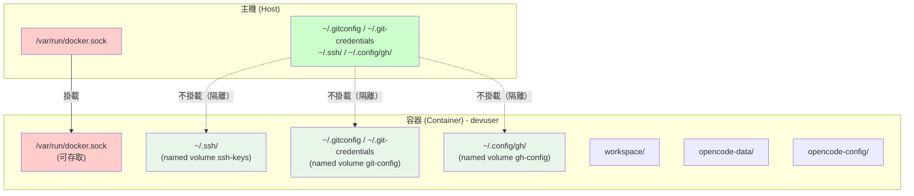
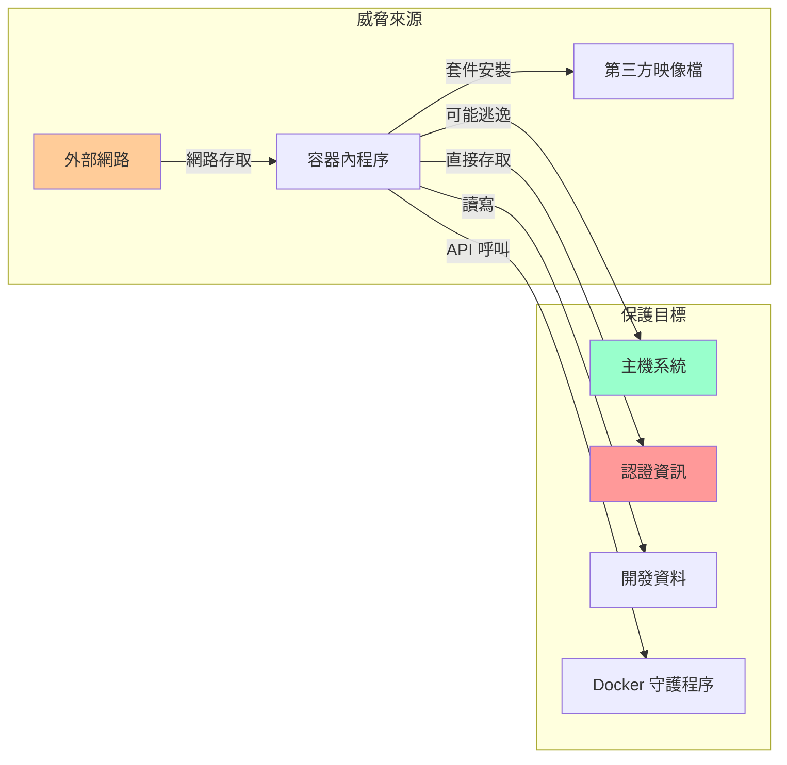
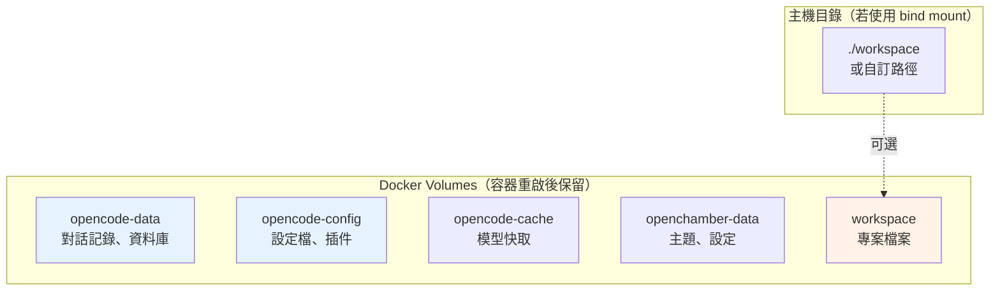
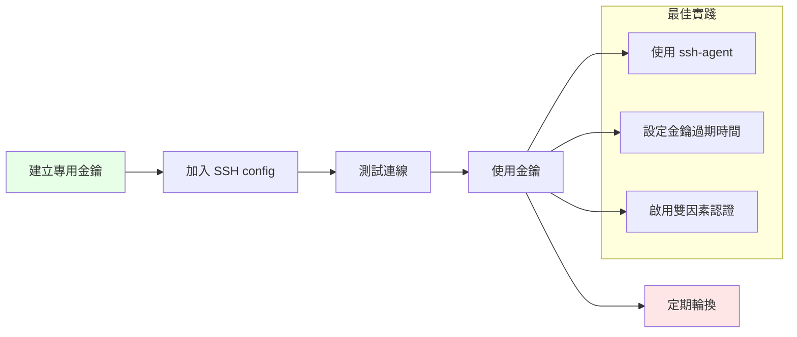
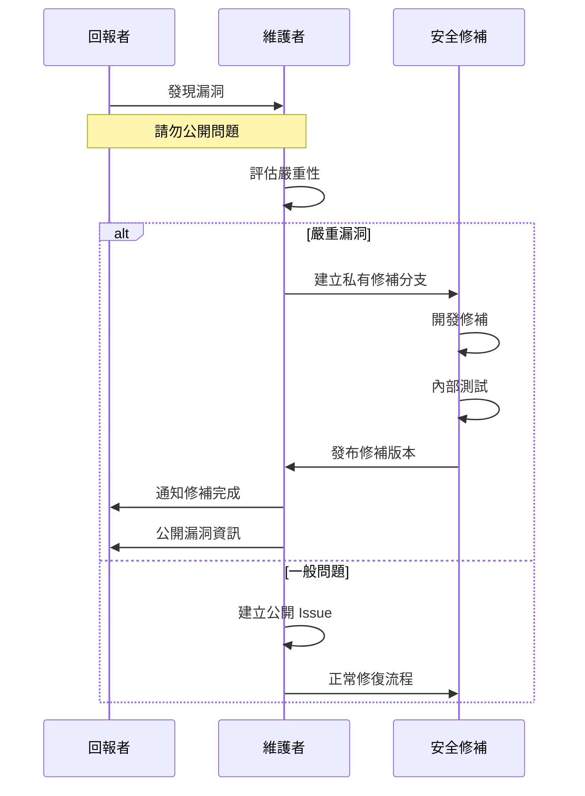
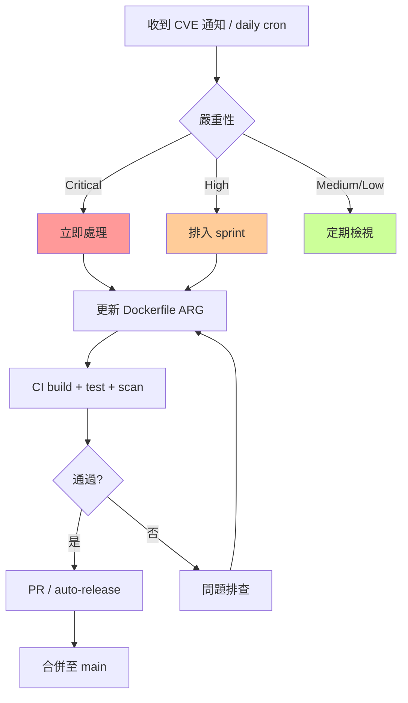

# 安全政策

本文檔說明 OpenChamber 專案的安全考量、風險評估及最佳實踐。

## 目錄

- [安全架構](#安全架構)
- [風險評估矩陣](#風險評估矩陣)
- [資料存取範圍](#資料存取範圍)
- [安全最佳實踐](#安全最佳實踐)
- [漏洞回報流程](#漏洞回報流程)
- [安全設定檢查清單](#安全設定檢查清單)

## 安全架構

### 系統權限架構



> **設計重點**：容器內的 SSH 金鑰、git 認證、GitHub CLI 認證皆使用**獨立的 named volume**（`ssh-keys`、`git-config`、`gh-config`），由 `entrypoint.d/04-init-git-ssh.sh` 等腳本在首次啟動時建立空白檔案。**主機的認證資料完全不會被掛載進容器**，形成雙向隔離：容器被入侵時無法存取主機金鑰；主機的認證資料也不會暴露給容器內的程序。唯一跨邊界共享的是 Docker socket（必要的管理需求）。

### 安全威脅模型



## 風險評估矩陣

| 風險項目 | 嚴重性 | 可能性 | 風險等級 | 緩解措施 |
|---------|--------|--------|---------|---------|
| Docker socket 存取 | 高 | 中 | 🔴 高 | 僅在信任環境使用 |
| SSH 金鑰存取 | 高 | 低 | 🟡 中 | 容器使用獨立 named volume `ssh-keys`（不掛載主機金鑰） |
| Git credential 洩漏 | 中 | 低 | 🟡 中 | 容器使用獨立 named volume（不與主機共用），降低雙向洩漏風險 |
| 容器逃逸 | 高 | 低 | 🟡 中 | 使用官方映像 + 定期更新 |
| 供應鏈攻擊 | 高 | 低 | 🟡 中 | 鎖定版本 + 漏洞掃描 |
| 預設密碼未更改 | 中 | 高 | 🟡 中 | 啟動時提醒修改 |

## 資料存取範圍

### 跨邊界共享資源（host bind mount）

| 路徑 | 掛載模式 | 說明 | 風險等級 |
|------|----------|------|---------|
| `/var/run/docker.sock` | 讀寫 | Docker API（唯一從主機掛載的資源） | 🔴 高 |

### 容器內獨立認證 volume（不從主機掛載）

| Volume 名稱 | 容器路徑 | 對應的 symlink | 說明 | 風險等級（容器被入侵時） |
|------|----------|------|---------|---------|
| `ssh-keys` | `~/.ssh/` | — | SSH 金鑰 | 🔴 高 |
| `git-config` | `~/.config/git/` | `~/.gitconfig`、`~/.git-credentials` | Git 認證資料 | 🔴 高 |
| `gh-config` | `~/.config/gh/` | — | GitHub CLI 認證 | 🟡 中 |

### 容器內部資料卷



## 安全最佳實踐

### 1. 密碼設定

```bash
# 修改預設密碼
cat > .env << 'EOF'
OPENCODE_SERVER_PASSWORD=您的強密碼
OPENCHAMBER_UI_PASSWORD=您的強密碼
EOF
```

**密碼要求：**
- 長度至少 12 字元
- 包含大小寫字母、數字、特殊符號
- 不要使用常見密碼或個人資料

### 2. 網路隔離

```yaml
# docker-compose.yml 建議修改
services:
  ai-dev:
    # 移除不必要的埠號對外暴露
    ports:
      - "127.0.0.1:${CHAMBER_PORT:-8000}:3000"  # 僅本機存取
      - "127.0.0.1:${OLLAMA_PORT:-11434}:11434"  # 僅本機存取
```

### 3. SSH 金鑰管理



### 4. Docker 安全

```bash
# 檢查容器權限
docker inspect ai-dev --format '{{.HostConfig.Privileged}}'
# 應該輸出 false

# 檢查能力設定
docker inspect ai-dev --format '{{.HostConfig.CapAdd}}'
# 應該是空的或最小化
```

### 5. 映像檔安全

- 使用官方映像檔（`ubuntu:24.04`）
- CI 已整合 Grype 漏洞掃描
- 定期更新至最新版本

## 漏洞回報流程



### 回報方式

1. **安全性漏洞**：請透過以下方式私密回報
   - Email: tryweb@ichiayi.com
   - 主題：`[SECURITY] OpenChamber 漏洞回報`

2. **一般問題**：使用 GitHub Issues

### 回報內容應包含

- 漏洞描述
- 重現步驟
- 影響範圍
- 建議修補方案（如有）

## 安全設定檢查清單

### 初次部署

- [ ] 變更 `OPENCODE_SERVER_PASSWORD` 預設值
- [ ] 變更 `OPENCHAMBER_UI_PASSWORD` 預設值
- [ ] 確認不需要 SSH 金鑰時，移除相關掛載
- [ ] 評估是否需要 Docker socket 存取
- [ ] 設定防火牆限制存取來源

### 定期檢查

- [ ] 每月更新映像檔版本
- [ ] 檢查依賴套件漏洞
- [ ] 審查存取日誌
- [ ] 輪換密碼和金鑰

### 開發環境 vs 生產環境

| 項目 | 開發環境 | 生產環境 |
|------|---------|---------|
| Docker socket | 可啟用 | 應禁用 |
| SSH 金鑰 | 可掛載 | 不建議 |
| 埠號綁定 | 0.0.0.0 | 127.0.0.1 |
| 預設密碼 | 可接受 | 必須修改 |
| 日誌級別 | DEBUG | WARN/ERROR |

## 版本管理與 CVE 追蹤

### 來源：Dockerfile

所有可執行元件的版本都是 **`Dockerfile` 的 `ARG` 宣告** 為唯一來源（single source of truth）：

- `DOCKER_VERSION` / `COMPOSE_VERSION` / `BUILDX_VERSION`
- `OPENCODE_VERSION` / `OPENCHAMBER_VERSION` / `GLAB_VERSION` / `GH_VERSION` / `MARKSMAN_VERSION`
- `PLAYWRIGHT_VERSION` / `PLAYWRIGHT_MCP_VERSION`
- `OH_MY_OPENAGENT_VERSION`（runtime 追蹤 latest）
- `UPGRADE_PACKAGES=true`（build 時 `apt-get upgrade`）

> 本文件**不再**硬編碼版本表 — 任何列出特定版本號的段落都會在 CI 升版後過時。

### 自動化更新流程

版本監控與升級由 `.github/workflows/dependency-update.yml` **每日 20:00 UTC** 自動執行：

1. 對比 `Dockerfile` pinned 與上游 GitHub Release / npm registry
2. 對比 `lean-ctx` snapshot 與當前 latest
3. 對比 `ubuntu:24.04` base image 內 apt 套件 snapshot
4. 跑 build + test + Grype 掃描（與上一個 stable release 做 critical CVE delta）
5. 依決策樹自動動作：
   - Dockerfile 變更 + 全過 → 開 PR（人工 review 破壞性變更）
   - 只 latest / apt 變更 + 全過 → 自動 release（push GHCR + tag + GitHub Release）
   - 任一失敗 → 開 issue

> Grype 結果同時上傳到 GitHub Security tab，與 dependency graph 整合追蹤。

### 版本更新流程



### 手動更新檢查命令

```bash
# 檢查 Docker CLI 最新版本
curl -s https://api.github.com/repos/moby/moby/releases/latest | jq -r '.tag_name'

# 檢查 Docker Compose 最新版本
curl -s https://api.github.com/repos/docker/compose/releases/latest | jq -r '.tag_name'

# 檢查 Ubuntu 套件更新
apt-get update && apt-get list --upgradable

# 執行漏洞掃描
grype ai-engkit:latest
```

### 待處理事項

技術債務、安全改進、功能請求統一在 [GitHub Issues](https://github.com/tryweb/ai-engkit/issues) 追蹤與管理。

---

## 相關資源

- [Docker 安全最佳實踐](https://docs.docker.com/engine/security/)
- [OWASP 容器安全](https://owasp.org/www-project-container-security/)
- [Ubuntu 安全指南](https://ubuntu.com/security)
- [GitHub Security Advisories](https://github.com/advisories)

---

> ⚠️ **重要提醒**：本專案設計用於受信任的開發環境。在不受信任的網路環境中使用前，請務必審慎評估安全風險。
