# 故障排除指南

本文檔彙整 OpenChamber 常見問題及解決方案。

## 目錄

- [快速診斷流程](#快速診斷流程)
- [容器問題](#容器問題)
- [網路連線問題](#網路連線問題)
- [權限問題](#權限問題)
- [Ollama 問題](#ollama-問題)
- [Web UI 問題](#web-ui-問題)
- [效能問題](#效能問題)
- [資料問題](#資料問題)
- [日誌與調試](#日誌與調試)

## 快速診斷流程

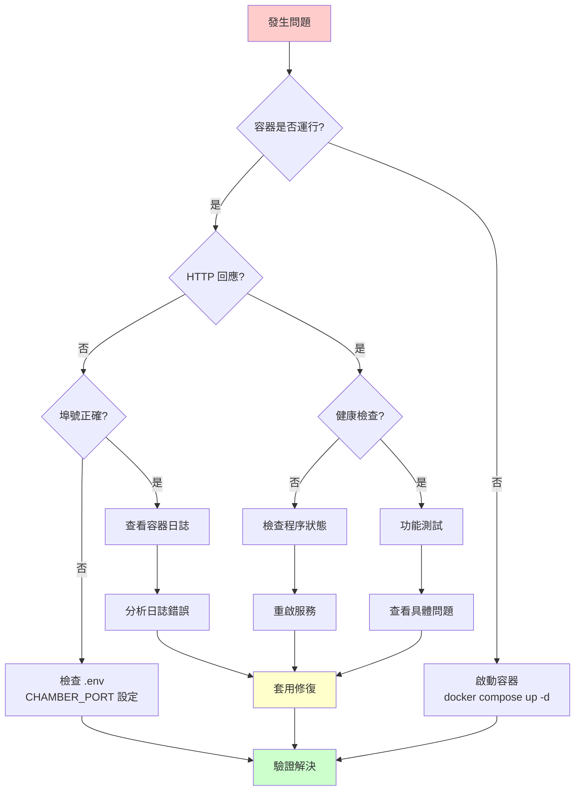

## 容器問題

### 容器無法啟動

**症狀**：執行 `docker compose up -d` 後容器不存在或立即退出

```bash
# 檢查容器狀態
docker compose ps -a

# 查看錯誤日誌
docker compose logs
```

**可能原因及解決方案**：

| 原因 | 錯誤訊息範例 | 解決方案 |
|------|-------------|---------|
| 埠號衝突 | `Bind for 0.0.0.0:8000 failed: port is already allocated` | 修改 `.env` 中的 `CHAMBER_PORT` |
| 映像檔不存在 | `Error response from daemon: pull access denied` | 執行 `docker compose pull` |
| 磁碟空間不足 | `no space left on device` | 清理 Docker 資源：`docker system prune -a` |
| 記憶體不足 | `container killed` | 增加 Docker Desktop 記憶體限制 |

### 容器頻繁重啟

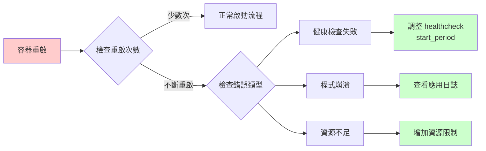

```bash
# 檢查重啟原因
docker inspect ai-dev --format '{{.RestartCount}}'
docker logs --tail 100 ai-dev

# 重置並重新啟動
docker compose down
docker compose up -d
```

## 網路連線問題

### 無法存取 Web UI

**診斷步驟**：

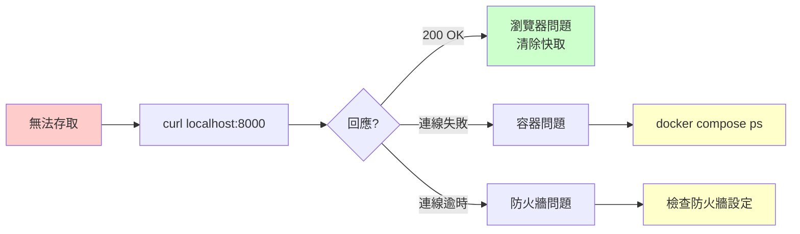

```bash
# 1. 確認容器是否運行
docker compose ps

# 2. 測試容器內部連線
docker exec ai-dev curl -s -o /dev/null -w "%{http_code}" http://localhost:3000

# 3. 測試主機連線
curl -s -o /dev/null -w "%{http_code}" http://localhost:${CHAMBER_PORT:-8000}

# 4. 檢查埠號映射
docker port ai-dev
```

**常見解決方案**：

```bash
# 埠號被佔用
netstat -tlnp | grep 8000
# 修改 .env
echo "CHAMBER_PORT=8001" >> .env
docker compose up -d

# 防火牆阻擋（Ubuntu）
sudo ufw allow 8000/tcp
```

### Ollama 連線失敗

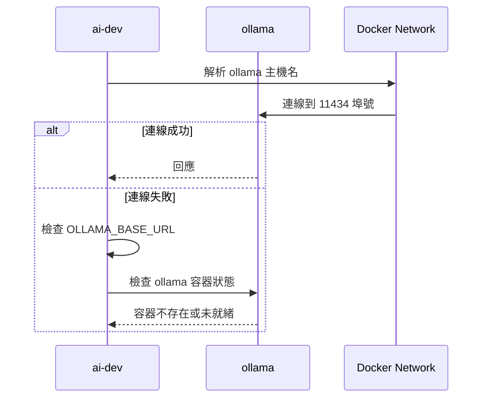

```bash
# 檢查 Ollama 容器
docker compose ps ollama
docker compose logs ollama

# 測試 Ollama API
docker exec ollama curl -s http://localhost:11434/api/tags

# 檢查環境變數
docker exec ai-dev env | grep OLLAMA
```

## 權限問題

### 權限錯誤診斷圖

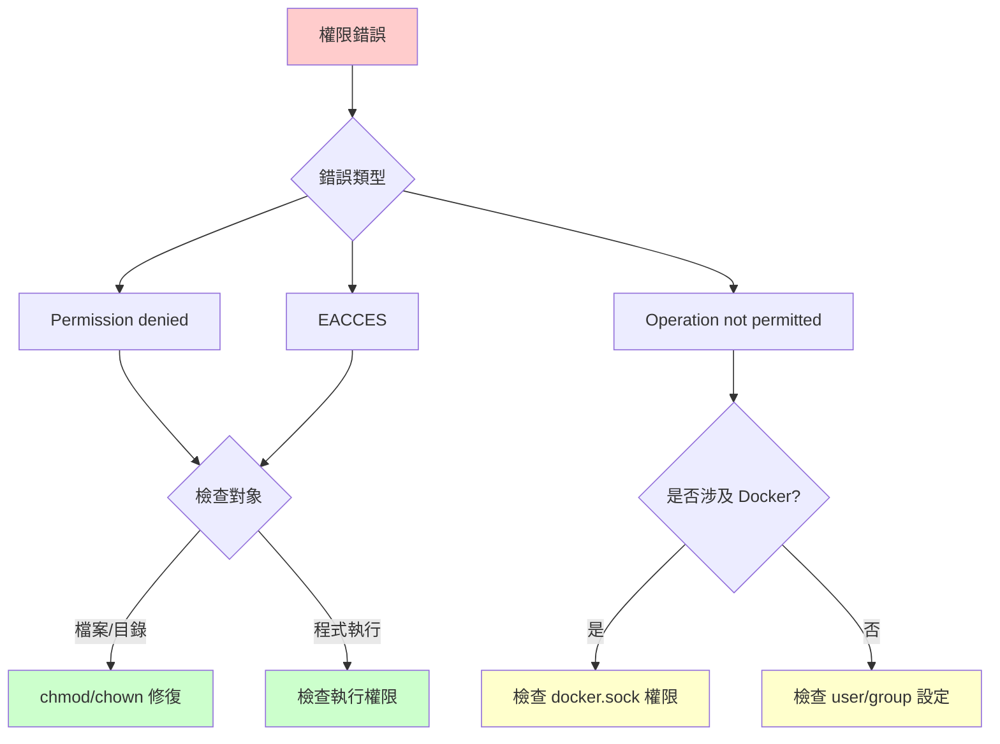

### Workspace 權限問題

```bash
# 診斷權限
docker exec ai-dev ls -la /home/devuser/workspace
docker exec ai-dev id

# 修復權限
docker exec ai-dev sudo chown -R devuser:devuser /home/devuser/workspace

# 或重新建立容器
docker compose down
docker compose up -d
```

### SSH 金鑰權限

```bash
# 檢查金鑰權限
ls -la ~/.ssh/
# 應該是：
# -rw------- (600) 私鑰
# -rw-r--r-- (644) 公鑰

# 修復權限
chmod 600 ~/.ssh/id_*
chmod 644 ~/.ssh/*.pub
```

### Docker Socket 存取

```bash
# 檢查 socket 權限
ls -la /var/run/docker.sock

# 檢查容器內是否可存取
docker exec ai-dev docker ps

# 如果無權限，將 devuser 加入 docker 群組
docker exec -u root ai-dev usermod -aG docker devuser
docker compose restart ai-dev
```

## Ollama 問題

### 模型下載失敗

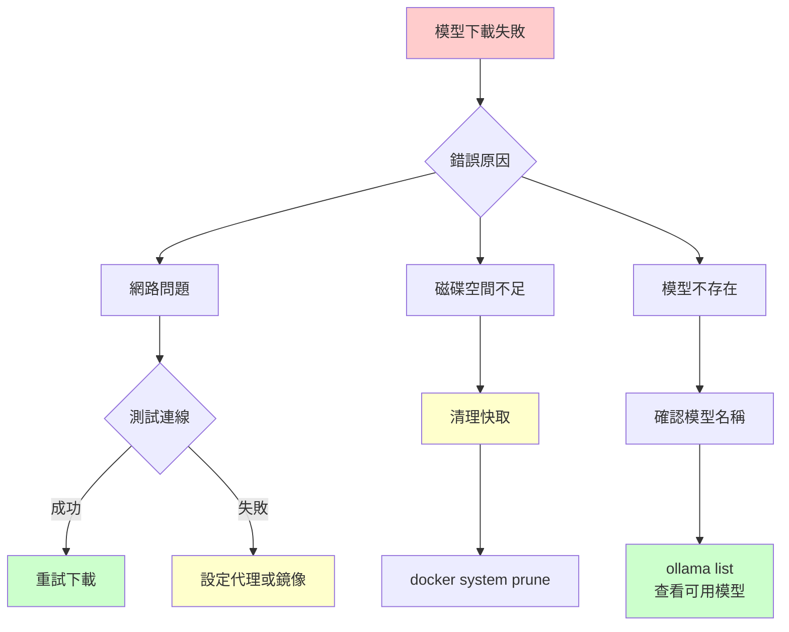

```bash
# 檢查 Ollama 狀態
docker compose logs ollama

# 列出已下載模型
docker exec ollama ollama list

# 手動下載模型
docker exec ollama ollama pull nomic-embed-text

# 檢查磁碟空間
docker exec ollama df -h /root/.ollama
```

### Ollama 記憶體不足

```bash
# 檢查可用記憶體
free -h

# 設定較小的模型
# 在 .env 中調整
echo "OLLAMA_MODEL=qwen2:0.5b" >> .env

# 或設定記憶體限制
# 在 docker-compose.yml 中加入
# environment:
#   - OLLAMA_MAX_LOADED_MB=2048
```

## Web UI 問題

### 認證失敗

```bash
# 確認密碼設定
docker exec ai-dev env | grep OPENCHAMBER_UI_PASSWORD

# 重設密碼
echo "OPENCHAMBER_UI_PASSWORD=新密碼" >> .env
docker compose restart ai-dev
```

### 頁面載入失敗

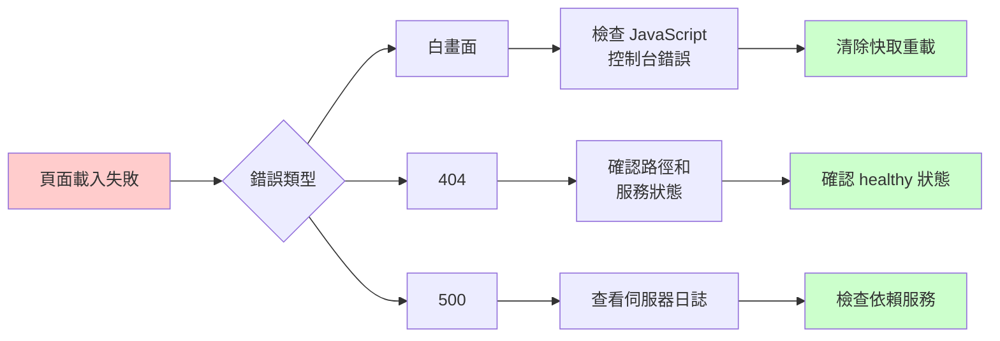

```bash
# 檢查健康狀態
curl http://localhost:${CHAMBER_PORT:-8000}/health | jq .

# 查看容器日誌
docker compose logs --tail 50 ai-dev
```

## 效能問題

### 響應緩慢診斷

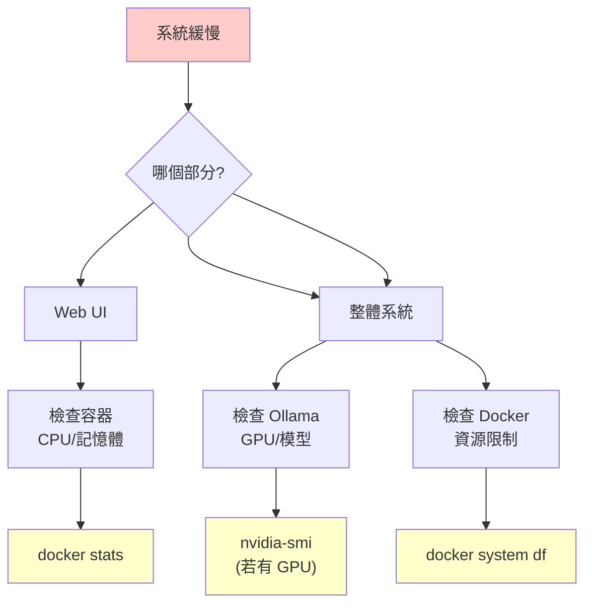

```bash
# 即時監控資源使用
docker stats

# 歷史資源使用
docker system df

# 檢查容器限制
docker inspect ai-dev --format '{{.HostConfig.Memory}}'
docker inspect ai-dev --format '{{.HostConfig.NanoCpus}}'
```

### 增加資源限制

```yaml
# docker-compose.yml
services:
  ai-dev:
    deploy:
      resources:
        limits:
          memory: 8G
          cpus: '4'
```

## 資料問題

### 資料遺失

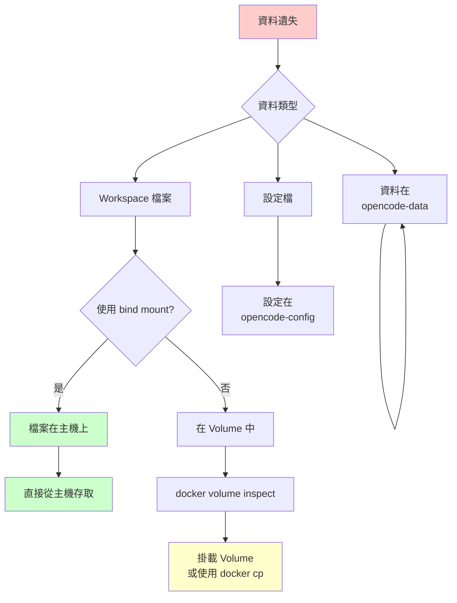

```bash
# 檢查 Volume 狀態
docker volume ls
docker volume inspect opencode-data

# 從 Volume 恢復檔案
docker run --rm -v opencode-data:/data alpine ls -la /data

# 複製檔案到主機
docker cp ai-dev:/home/devuser/workspace/重要檔案 ./備份/
```

### 資料庫損壞

```bash
# 備份資料庫
docker cp ai-dev:/home/devuser/.local/share/opencode/opencode.db ./opencode.db.backup

# 如果資料庫損壞，可能需要刪除重建
docker compose down
docker volume rm opencode-data
docker compose up -d
```

## 日誌與調試

### 取得日誌

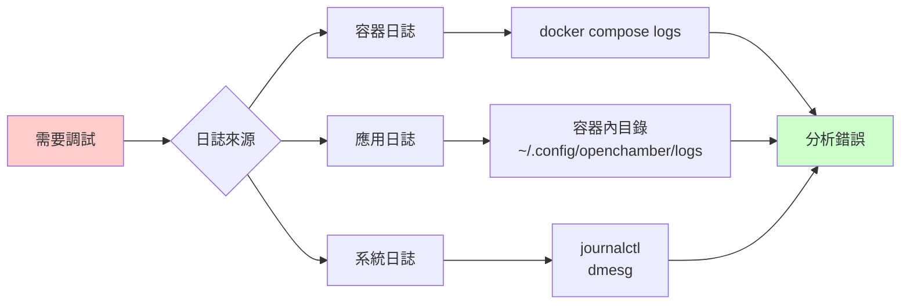

```bash
# 即時查看日誌
docker compose logs -f

# 查看特定服務日誌
docker compose logs ollama
docker compose logs ai-dev

# 查看最近日誌
docker compose logs --tail 100

# 匯出日誌到檔案
docker compose logs > debug.log 2>&1
```

### 進入容器調試

```bash
# 進入容器
docker exec -it ai-dev bash

# 檢查程序
ps aux

# 檢查網路
netstat -tlnp
curl localhost:3000/health

# 檢查檔案系統
ls -la ~/.config/
df -h
```

### 重置環境

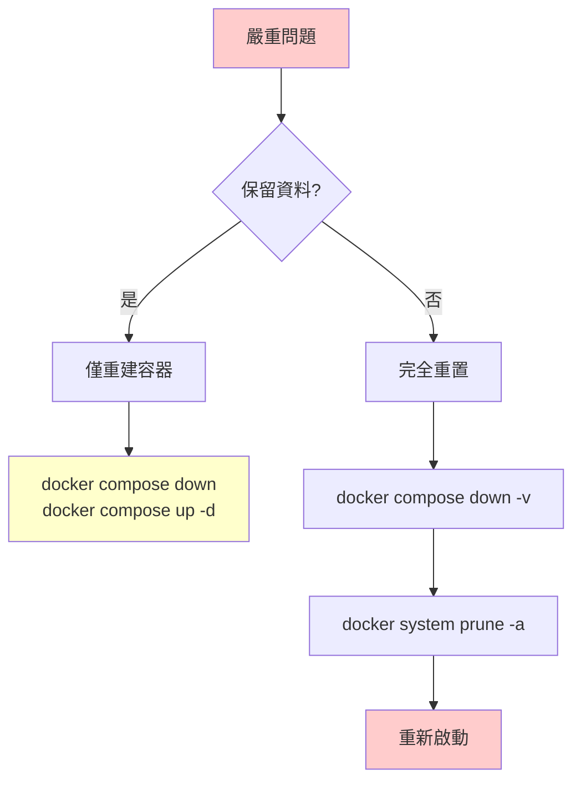

```bash
# 輕度重置（保留資料）
docker compose down
docker compose up -d

# 完全重置（刪除所有資料）
docker compose down -v
docker system prune -a
docker compose up -d
```

## 常見錯誤代碼速查

| 錯誤代碼 | 可能原因 | 解決方案 |
|---------|---------|---------|
| `EADDRINUSE` | 埠號被佔用 | 修改 `CHAMBER_PORT` |
| `EACCES` | 權限不足 | 檢查檔案/目錄權限 |
| `ENOENT` | 檔案不存在 | 確認路徑正確 |
| `ENOMEM` | 記憶體不足 | 增加 Docker 記憶體限制 |
| `ECONNREFUSED` | 連線被拒絕 | 檢查服務是否運行 |
| `ETIMEDOUT` | 連線逾時 | 檢查網路和防火牆 |

## 仍然無法解決？

1. **收集診斷資訊**：
   ```bash
   docker compose ps > diagnostics.txt
   docker compose logs >> diagnostics.txt
   docker stats --no-stream >> diagnostics.txt
   ```

2. **搜尋現有問題**：[GitHub Issues](https://github.com/tryweb/codeforge/issues)

3. **提交新 Issue**：附上診斷資訊和重現步驟

---

> 💡 **提示**：執行 `./test/run-tests.sh` 可以快速診斷大部分問題。
