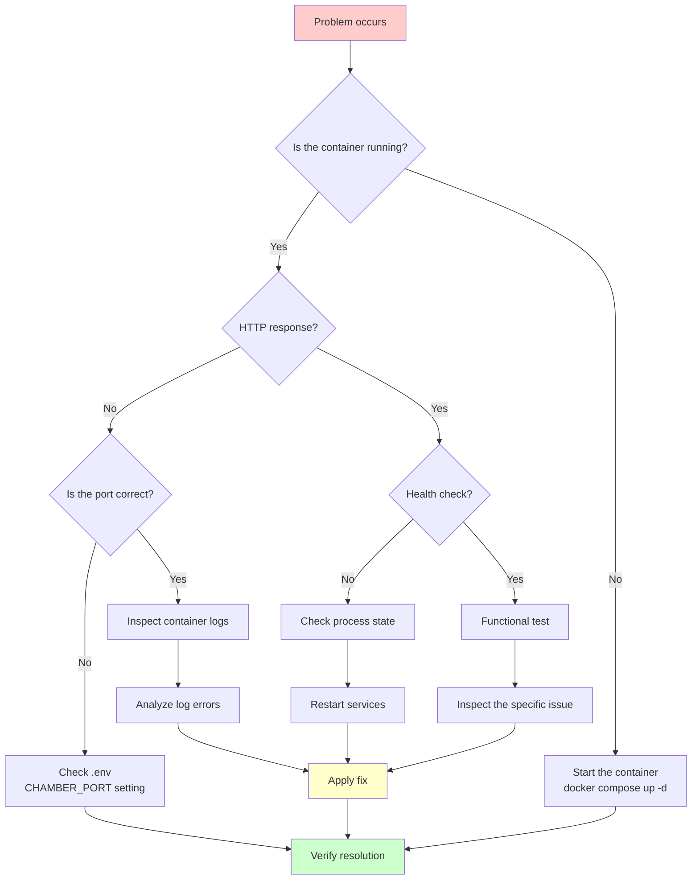
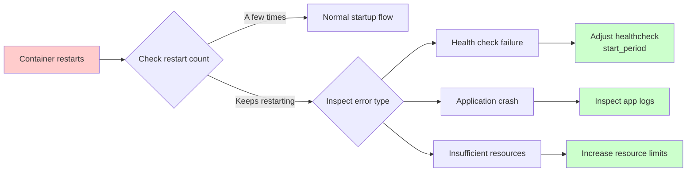
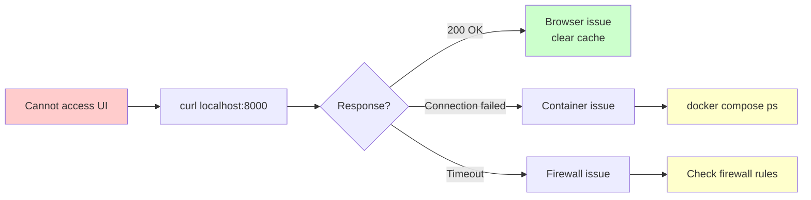
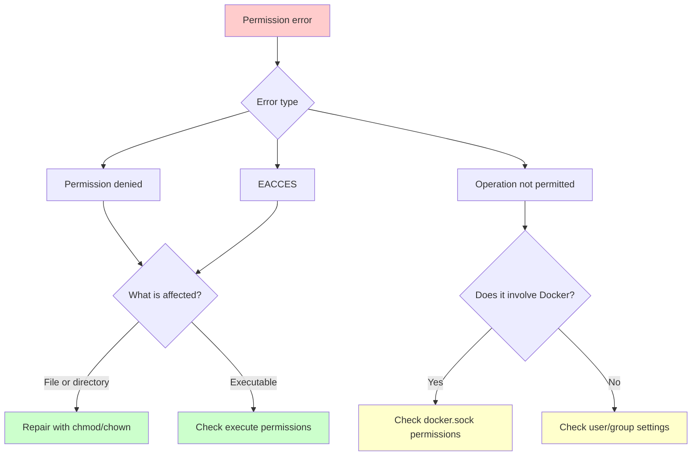
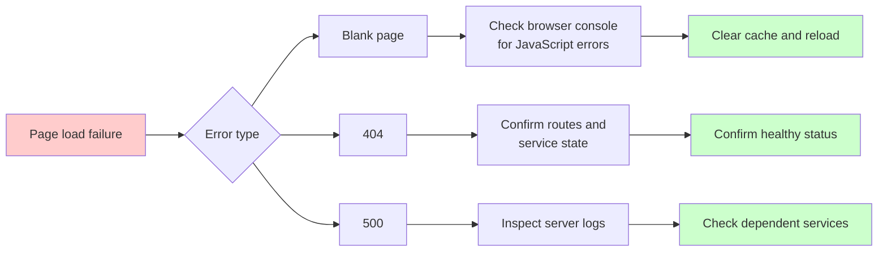
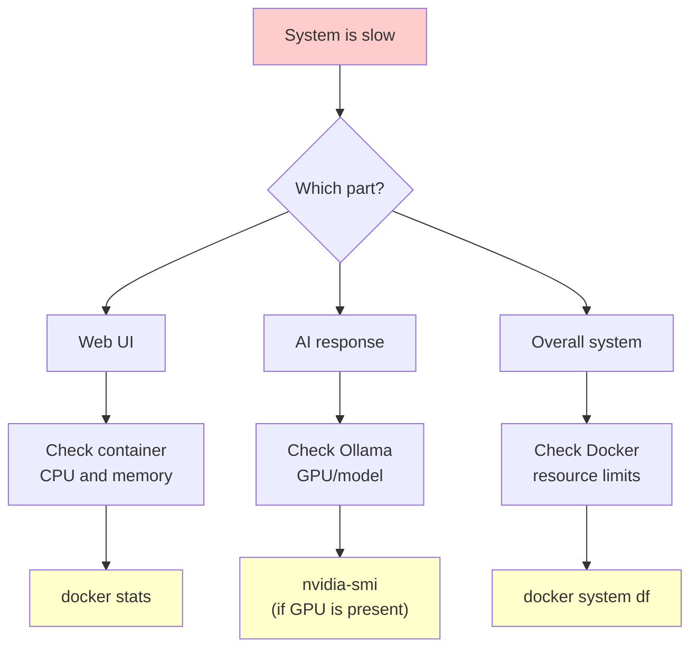
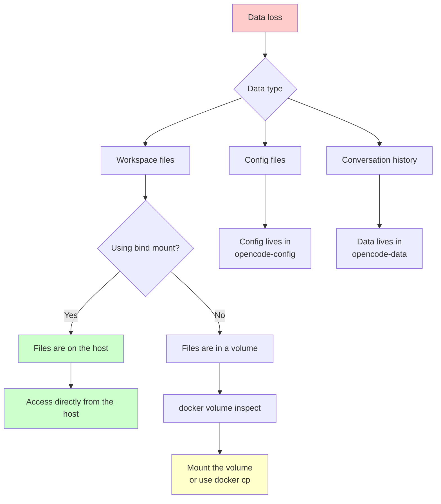
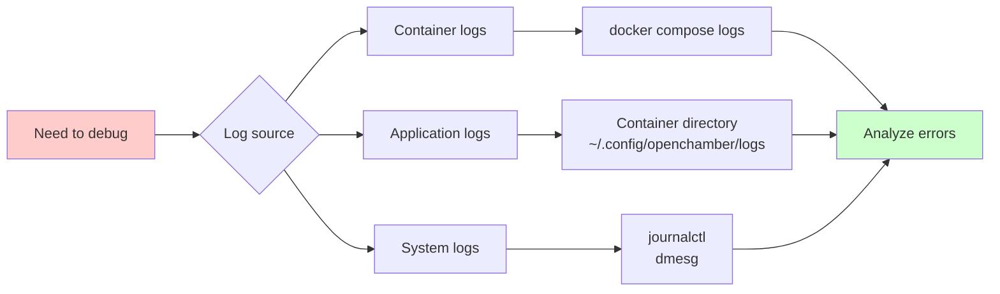
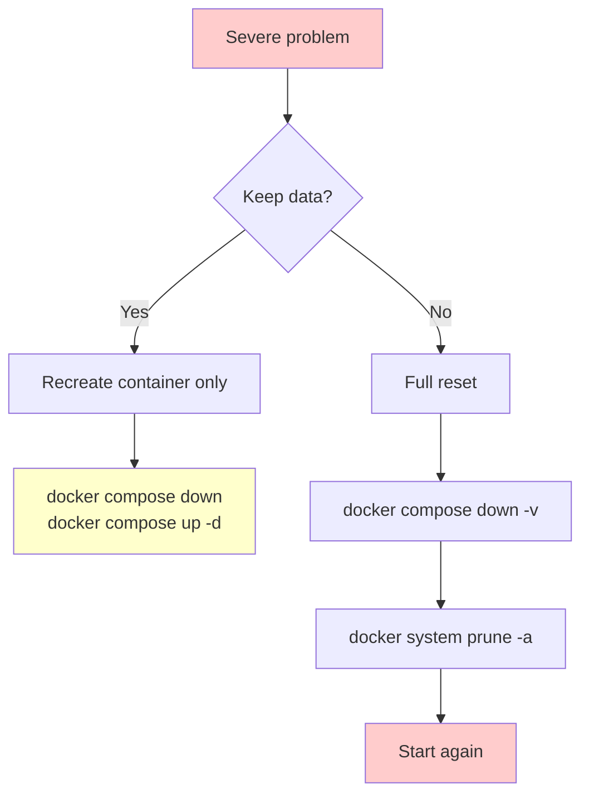

# Troubleshooting Guide

This document collects common ai-engkit issues and their recommended fixes.

## Table of Contents

- [Quick Diagnostic Flow](#quick-diagnostic-flow)
- [Container Issues](#container-issues)
- [Network Connectivity Issues](#network-connectivity-issues)
- [Permission Issues](#permission-issues)
- [Web UI Issues](#web-ui-issues)
- [Performance Issues](#performance-issues)
- [Data Issues](#data-issues)
- [Logs and Debugging](#logs-and-debugging)

## Quick Diagnostic Flow



## Container Issues

### Container Fails to Start

**Symptom**: after `docker compose up -d`, the container does not exist or exits immediately.

```bash
# Check container status
docker compose ps -a

# View error logs
docker compose logs
```

**Possible causes and fixes**:

| Cause | Example error | Fix |
| Port conflict | `Bind for 0.0.0.0:8000 failed: port is already allocated` | Change `CHAMBER_PORT` in `.env` |
| Image missing | `Error response from daemon: pull access denied` | Run `docker compose pull` |
| Disk full | `no space left on device` | Clean Docker resources: `docker system prune -a` |
| Insufficient memory | `container killed` | Increase Docker Desktop memory limits |

### Container Restarts Frequently



```bash
# Check restart reason
docker inspect ai-dev --format '{{.RestartCount}}'
docker logs --tail 100 ai-dev

# Reset and restart
docker compose down
docker compose up -d
```

## Network Connectivity Issues

### Cannot Access the Web UI

**Diagnostic steps**:



```bash
# 1. Confirm the container is running
docker compose ps

# 2. Test connectivity inside the container
docker exec ai-dev curl -s -o /dev/null -w "%{http_code}" http://localhost:3000

# 3. Test host connectivity
curl -s -o /dev/null -w "%{http_code}" http://localhost:${CHAMBER_PORT:-8000}

# 4. Check port mapping
docker port ai-dev
```

**Common fixes**:

```bash
# Port is already in use
netstat -tlnp | grep 8000

# Change .env
echo "CHAMBER_PORT=8001" >> .env
docker compose up -d

# Firewall blocked the port (Ubuntu)
sudo ufw allow 8000/tcp
```

### A Nested Project Started Inside the Container Is Not Reachable from the Host

> ⚠️ **This section describes a host Docker daemon environment issue, not an ai-engkit bug.** On a standard Docker host (CI / staging / production), this usually does not happen. It belongs to the same class of issue as [glab as a Git credential helper with a versioned path](#glab-as-a-git-credential-helper-with-a-versioned-path): the problem is on the user's host, not inside the container.

**Scenario**: you start your own nested project inside the ai-engkit container with `docker compose up -d`. Port mapping looks correct (for example, `0.0.0.0:8020:80`), but from the host `curl http://localhost:8020/` returns `Connection refused`.

**Quick diagnosis** (run inside the ai-engkit container):

```bash
# 1. Is the nested project container running? Was port mapping created?
docker ps --format 'table {{.Names}}\t{{.Ports}}'

# 2. Is the service reachable inside the nested container?
docker exec <nested-project-container> curl -s -o /dev/null -w "%{http_code}\n" http://localhost:80

# 3. What is the bridge gateway IP?
docker network inspect <nested-project-network> --format '{{range .IPAM.Config}}{{.Gateway}}{{end}}'
```

**Three-result matrix**:

| Test location | Result | Meaning |
|---------|------|------|
| `curl http://<container IP>:8020/` | ❌ Connection refused | The nested container usually lives in 172.20.0.0/16 and the host route table has no route for that subnet |
| `curl http://localhost:8020/` | ❌ Connection refused | The host `docker-proxy` did not start, so the host is not listening on 8020 |
| `curl http://<bridge gateway>:8020/` | ✅ 200 OK | **The service itself is healthy; the problem is host-side NAT only** |

**Root causes** (outside ai-engkit):

1. **Missing bridge route on the host**: Docker Compose creates a bridge network (for example 172.20.0.0/16), but the host route table has no corresponding route. Direct host access to the container IP fails.
2. **Host `docker userland-proxy` is not running**: `daemon.json` may have `userland-proxy: true`, but dockerd did not start the proxy process. This is common with multiple network namespaces, custom iptables rules, rootless Docker, WSL2, and similar setups.

**Temporary workaround** (run inside the ai-engkit container to bypass host NAT):

```bash
# Use the bridge gateway IP instead of localhost
curl http://<bridge gateway>:8020/
```

**Permanent fix** (**host-side only**, not part of ai-engkit):

```bash
# 1. Confirm Docker iptables chains still exist
sudo iptables -t nat -L -n | grep -i docker
sudo iptables -L -n      | grep -i docker

# 2. Missing chains? Restart dockerd so it recreates them
sudo systemctl restart docker

# 3. Still broken? Inspect dockerd logs
sudo journalctl -u docker --since "10 min ago"

# 4. Confirm daemon.json did not disable userland-proxy
cat /etc/docker/daemon.json   # should include "ip-forward": true, "userland-proxy": true
```

**How to confirm this is not an ai-engkit issue**:

- Run the same nested project `docker-compose.yml` on a standard Docker host. If it works there, the current host environment is the culprit.
- Inside the ai-engkit container, if `docker exec <nested-project-container> curl http://localhost:80` returns 200, the nested service itself is healthy.

## Permission Issues

### Permission Error Diagnostic Map



### Workspace Permission Problems

```bash
# Diagnose permissions
docker exec ai-dev ls -la /home/devuser/workspace
docker exec ai-dev id

# Repair permissions
docker exec ai-dev sudo chown -R devuser:devuser /home/devuser/workspace

# Or recreate the container
docker compose down
docker compose up -d
```

### SSH Key Permissions

> ⚠️ Since v0.5.0, SSH setup uses the `ssh-keys` named volume and is managed automatically inside the container.
> For custom SSH keys, see [initialization script order](./ARCHITECTURE.md#initialization-script-order).

```bash
# Check key permissions inside the container
docker exec ai-dev ls -la /home/devuser/.ssh/
# Expected:
# -rw-r--r-- (644) public key

# Fix permissions if needed
docker exec ai-dev chmod 600 /home/devuser/.ssh/id_*
docker exec ai-dev chmod 644 /home/devuser/.ssh/*.pub
```

### GitHub CLI Permissions

> ⚠️ Since v0.6.0, GitHub CLI settings use the `gh-config` named volume and are managed automatically inside the container.

```bash
# Check GitHub CLI config permissions inside the container
docker exec ai-dev ls -la /home/devuser/.config/gh/

# Fix permissions if needed
docker exec ai-dev sudo chown -R devuser:devuser /home/devuser/.config/gh/
```

### glab as a Git Credential Helper with a Versioned Path

> Related issue: [#4](https://github.com/tryweb/ai-engkit/issues/4)
> Note: this happens on the user's **host** environment, not inside the container. Inside the container, Git uses `credential.helper store` (see `entrypoint.d/04-init-git-ssh.sh`), so the problem does not apply there.

**Symptom**: after you manually configure `glab` as Git's credential helper, `brew upgrade glab` breaks authenticated operations such as `push` and `pull`:

```
/home/linuxbrew/.linuxbrew/Cellar/glab/1.92.0/bin/glab auth git-credential get: not found
fatal: could not read Username for 'https://gitlab.example.com': No such device or address
```

**Cause**: `git config` stores the current Homebrew Cellar versioned path (for example `…/Cellar/glab/1.92.0/bin/glab`). After `brew upgrade glab`, Homebrew removes the old version directory, but Git keeps the stale path.

**Fix**: replace the Git config entry with Homebrew's stable symlink path:

```bash
# Replace the versioned path with the stable symlink path
git config --global --replace-all \
  credential.https://gitlab-238.ichiayi.com.helper \
  '!/home/linuxbrew/.linuxbrew/bin/glab auth git-credential'
```

`/home/linuxbrew/.linuxbrew/bin/glab` is a symlink that automatically points to the latest upgraded version.

**Prevention**: any Homebrew-installed CLI used as a Git credential helper (`gh`, `glab`, and similar tools) should use the stable `bin/` symlink path instead of a versioned Cellar path.

### Docker Socket Access

```bash
# Check socket permissions
ls -la /var/run/docker.sock

# Verify access from inside the container
docker exec ai-dev docker ps

# If access is denied, add devuser to the docker group
docker exec -u root ai-dev usermod -aG docker devuser
docker compose restart ai-dev
```

## Web UI Issues

### Authentication Failure

```bash
# Confirm password settings
docker exec ai-dev env | grep OPENCHAMBER_UI_PASSWORD

# Reset password
echo "OPENCHAMBER_UI_PASSWORD=[REDACTED:API key param]" >> .env
docker compose restart ai-dev
```

### Page Load Failure



```bash
# Check health status
curl http://localhost:${CHAMBER_PORT:-8000}/health | jq .

# View container logs
docker compose logs --tail 50 ai-dev
```

## Performance Issues

### Slow Response Diagnostics



```bash
# Real-time resource monitoring
docker stats

# Historical resource usage
docker system df

# Check container limits
docker inspect ai-dev --format '{{.HostConfig.Memory}}'
docker inspect ai-dev --format '{{.HostConfig.NanoCpus}}'
```

### Increase Resource Limits

```yaml
# docker-compose.yml
services:
  ai-dev:
    deploy:
      resources:
        limits:
          memory: 8G
          cpus: '4'
```

## Data Issues

### Data Loss



```bash
# Check volume state
docker volume ls
docker volume inspect opencode-data

# Inspect files inside the volume
docker run --rm -v opencode-data:/data alpine ls -la /data

# Copy files back to the host
docker cp ai-dev:/home/devuser/workspace/important-file ./backup/
```

### Database Corruption

```bash
# Back up the database
docker cp ai-dev:/home/devuser/.local/share/opencode/opencode.db ./opencode.db.backup

# If corruption is confirmed, you may need to rebuild it
docker compose down
docker volume rm opencode-data
docker compose up -d
```

## Logs and Debugging

### Collect Logs



```bash
# Follow logs in real time
docker compose logs -f

# View logs for a specific service
docker compose logs ai-dev

# View recent logs
docker compose logs --tail 100

# Export logs to a file
docker compose logs > debug.log 2>&1
```

### Enter the Container for Debugging

```bash
# Open a shell in the container
docker exec -it ai-dev bash

# Check running processes
ps aux

# Check networking
netstat -tlnp
curl localhost:3000/health

# Check the filesystem
ls -la ~/.config/
df -h
```

### Reset the Environment



```bash
# Light reset (keep data)
docker compose down
docker compose up -d

# Full reset (delete all data)
docker compose down -v
docker system prune -a
docker compose up -d
```

## Common Error Codes

| Error code | Possible cause | Fix |
|---------|---------|---------|
| `EADDRINUSE` | Port already in use | Change `CHAMBER_PORT` |
| `EACCES` | Insufficient permissions | Check file and directory permissions |
| `ENOENT` | File not found | Confirm the path is correct |
| `ENOMEM` | Not enough memory | Increase Docker memory limits |
| `ECONNREFUSED` | Connection refused | Check whether the service is running |
| `ETIMEDOUT` | Connection timed out | Check the network and firewall |

## Still Not Resolved?

1. **Collect diagnostics**:
   ```bash
   docker compose ps > diagnostics.txt
   docker compose logs >> diagnostics.txt
   docker stats --no-stream >> diagnostics.txt
   ```

2. **Search existing issues**: [GitHub Issues](https://github.com/tryweb/ai-engkit/issues)

3. **Open a new issue**: attach diagnostics and reproduction steps.

---

> 💡 **Tip**: Run `./test/run-tests.sh` to diagnose most common issues quickly.
